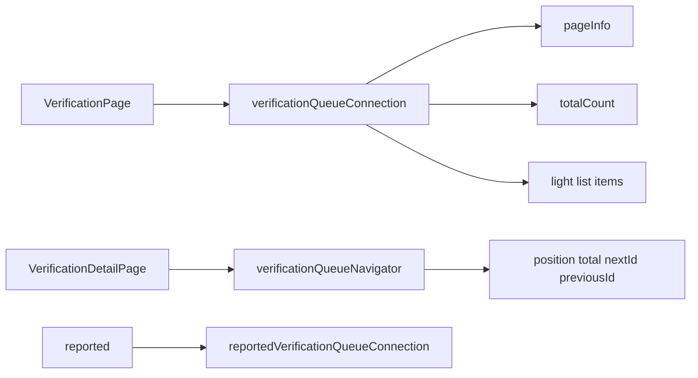

# SPEC-008: Exercise Report Verification Flow

## Cel biznesowy

Terapeuta ma móc zgłosić problem z ćwiczeniem dokładnie w miejscu pracy (lista ćwiczeń lub detal ćwiczenia), a zgłoszenie ma trafiać do spójnego flow weryfikacyjnego używanego przez Content Managerów.

Funkcjonalność redukuje ryzyko błędnych treści w bibliotece ćwiczeń i skraca czas od wykrycia problemu do naprawy.

## Architektura

Flow jest additive-first i nie zmienia semantyki istniejącego `Exercise.status`.
Wprowadzamy nowy byt raportowy `ExerciseReport` oraz nowy ingress do istniejącej kolejki `verification`.

```mermaid
flowchart LR
therapist[Therapist] --> listEntry[Exercises list menu]
therapist --> detailEntry[Exercise detail CTA]
listEntry --> reportDialog[ReportExerciseDialog]
detailEntry --> reportDialog
reportDialog --> createReport[Create ExerciseReport]
createReport --> routing{Status and scope routing}
routing -->|Draft or Organization| pendingReview[Route to PendingReview]
routing -->|Published| updatePending[Route to UpdatePending candidate]
pendingReview --> verificationQueue[Verification queue]
updatePending --> verificationQueue
verificationQueue --> reviewer[ContentManager]
reviewer --> decision{Approve or reject}
decision -->|Approve| resolveReport[Resolve report]
decision -->|Request changes| feedbackLoop[adminReviewNotes plus resolve report]
feedbackLoop --> therapistSignal[Reporter sees accepted signal]
```

### Verification pagination architecture (2026-04)

Wraz ze wzrostem kolejki verification do tysięcy rekordów, endpointy listowe muszą być stronicowane po stronie serwera.

Założenia:
- pagination jest **server-side** (nie tylko UI slice),
- stan listy (`filter`, `search`, `page`, `pageSize`) jest utrzymywany w URL,
- detail queue (`/verification/[id]`) nie zależy od pełnej listy klientowej, tylko od dedykowanego navigatora kolejki.

## UI/UX Wireframes

### Entry points

- `Exercises list`:
  - nowa akcja `Zgłoś do poprawki` w menu karty ćwiczenia
- `Exercise detail`:
  - secondary CTA `Zgłoś do poprawki` obok akcji hero
  - ta sama akcja również w menu `Opcje`

### Report dialog

- komponent: `ReportExerciseDialog`
- pola MVP:
  - `reasonCategory` (required)
  - `description` (required, min length)
  - `attachments` (optional, max count + max size)
- skróty:
  - `Cmd/Ctrl+Enter` wysyła formularz
  - `Escape` zamyka dialog
- footer dialogu:
  - `Anuluj` po lewej
  - `Wyślij zgłoszenie` po prawej

### Verification integration

- nowy filtr `reported` w centrum weryfikacji
- karta i panel werdyktu pokazują kontekst zgłoszenia:
  - kto zgłosił
  - powód
  - opis
  - liczba otwartych zgłoszeń dla ćwiczenia
- decyzja recenzenta rozwiązuje zgłoszenie (`queue action resolves item`)

## Interfejsy

### GraphQL Queries/Mutations (plan kontraktowy)

> Uwaga: additive-first kontrakt dla backendu/shared schema.

- `CREATE_EXERCISE_REPORT_MUTATION`
- `GET_EXERCISE_REPORTS_QUERY`
- `GET_REPORTED_EXERCISES_QUERY` (alternatywnie rozszerzenie istniejących query verification)
- `RESOLVE_EXERCISE_REPORT_MUTATION`
- opcjonalnie `CREATE_UPDATE_PENDING_FROM_REPORT_MUTATION`
- `GET_VERIFICATION_QUEUE_CONNECTION_QUERY` (nowe paginowane źródło danych dla listy verification)
- `GET_VERIFICATION_QUEUE_NAVIGATOR_QUERY` (next/prev/position dla detalu)

### GraphQL contracts for pagination

Docelowy kontrakt (additive-first, bez łamania istniejących pól listowych):
- `verificationQueueConnection(filter, search, first, after)`
- `reportedVerificationQueueConnection(search, first, after)`
- `verificationQueueNavigator(currentExerciseId, filter, search)`

Minimalny shape odpowiedzi listowej:
- `edges[].node` (lekki read model: `id`, `name`, `status`, `thumbnailUrl`, `createdAt`, `createdBy`, `hasOpenReport`, `openReportCount`, `latestReportSummary`)
- `pageInfo` (`startCursor`, `endCursor`, `hasNextPage`, `hasPreviousPage`)
- `totalCount`

Minimalny shape navigatora:
- `currentExerciseId`
- `positionInQueue`
- `totalInQueue`
- `remainingCount`
- `nextExerciseId`
- `previousExerciseId`

### API pomocnicze w adminie (warstwa web)

- `POST /api/exercise-reports`:
  - tworzenie reportu + opcjonalna notyfikacja Discord
- `GET /api/exercise-reports`:
  - lista reportów (filtrowanie: `exerciseId`, `status`)
- `PATCH /api/exercise-reports`:
  - rozwiązanie reportów (`exerciseId` lub `reportId`)

### Kontrakt danych: ExerciseReport

- `id`
- `exerciseId`
- `exerciseName`
- `exerciseScope`
- `exerciseStatus`
- `organizationId`
- `reportedByUserId`
- `reportedByEmail`
- `reportedByName`
- `reasonCategory`
- `description`
- `attachments`
- `status` (`OPEN`, `RESOLVED`)
- `routingTarget` (`PENDING_REVIEW`, `UPDATE_PENDING`)
- `createdAt`
- `resolvedAt`
- `resolvedByUserId`
- `resolutionNote`

### Komponenty

| Komponent              | Lokalizacja                                          | Opis                                 |
| ---------------------- | ---------------------------------------------------- | ------------------------------------ |
| `ReportExerciseDialog` | `src/features/exercises/ReportExerciseDialog.tsx`    | Formularz zgłoszenia ćwiczenia       |
| `ExerciseCard`         | `src/features/exercises/ExerciseCard.tsx`            | Wejście `Zgłoś do poprawki` z listy  |
| `ExerciseDetailPage`   | `src/app/(dashboard)/exercises/[id]/page.tsx`        | Wejście `Zgłoś do poprawki` z detalu |
| `VerificationTaskCard` | `src/features/verification/VerificationTaskCard.tsx` | Badge i kontekst reportu             |
| `VerdictPanel`         | `src/features/verification/VerdictPanel.tsx`         | Sekcja kontekstu reportu + resolve   |

## Data-testid

- `exercise-card-{id}-report-btn`
- `exercise-detail-report-btn`
- `exercise-detail-report-hero-btn`
- `exercise-report-dialog`
- `exercise-report-reason-select`
- `exercise-report-description-input`
- `exercise-report-submit-btn`
- `exercise-report-cancel-btn`
- `verification-filter-reported`
- `verification-report-context`

## Risk Assessment

| Ryzyko                                                            | Wplyw                            | Mitigacja                                               |
| ----------------------------------------------------------------- | -------------------------------- | ------------------------------------------------------- |
| Drift statusów (`PUBLISHED`, `ARCHIVED_GLOBAL`, `UPDATE_PENDING`) | Błędny routing tasków            | Jedna funkcja routingu z testami jednostkowymi          |
| Mieszanie `adminReviewNotes` i treści reportu                     | Utrata kontekstu i regresje UX   | Osobny byt `ExerciseReport` i osobne pola prezentacyjne |
| Duplikaty tasków dla jednego ćwiczenia                            | Szum w kolejce                   | Agregacja OPEN reportów per `exerciseId`                |
| Brak backend kontraktu reportowego                                | Niespójność admin/mobile/backend | Additive-first spec + etapowa migracja kontraktu        |
| Regression w `SubmitToGlobal` i `CHANGES_REQUESTED`               | Krytyczne flow autora ćwiczeń    | Testy regresyjne i brak zmian semantyki statusów        |
| Rozjazd kolejności lista vs detal                                 | Błędne auto-advance / progress   | Jeden kanoniczny sort i dedykowany `verificationQueueNavigator` |
| Brak server-side search w paginacji                               | Niejednoznaczne wyniki i UX      | Search wykonywany po stronie backendu                   |
| Migracja na paginowany kontrakt złamie starych klientów           | Breaking change                  | Additive-first: nowe pola + deprecacja starych endpointów |

## Integration Test Coverage

| Scenariusz                                        | Typ testu                  | Priorytet |
| ------------------------------------------------- | -------------------------- | --------- |
| Zgłoszenie ćwiczenia z listy                      | Integracyjny               | High      |
| Zgłoszenie ćwiczenia z detalu                     | Integracyjny               | High      |
| Report trafia do filtra `reported` w verification | Integracyjny               | High      |
| `Published` route -> `UPDATE_PENDING` target      | Jednostkowy + integracyjny | High      |
| Decyzja recenzenta zamyka report                  | Integracyjny               | High      |
| `SubmitToGlobalDialog` bez regresji               | Regresyjny                 | High      |
| Paginacja listy verification + search + filter    | Integracyjny               | High      |
| Deep-link listy (`filter/search/page`)            | Integracyjny               | High      |
| Detail queue navigator (`next/prev/position`)     | Integracyjny               | High      |

## Changelog

### 2026-03-08

- Utworzenie specyfikacji flow zgłaszania ćwiczenia do weryfikacji.
- Dodanie kontraktów, ryzyk i planu testów dla modelu `ExerciseReport`.

### 2026-04-08

- Dodanie architektury server-side pagination dla Centrum Weryfikacji.
- Rozszerzenie kontraktów o `verificationQueueConnection` i `verificationQueueNavigator`.
- Doprecyzowanie ryzyk i testów dla paginacji, deep-linków i spójności lista/detal.
