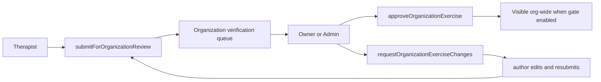
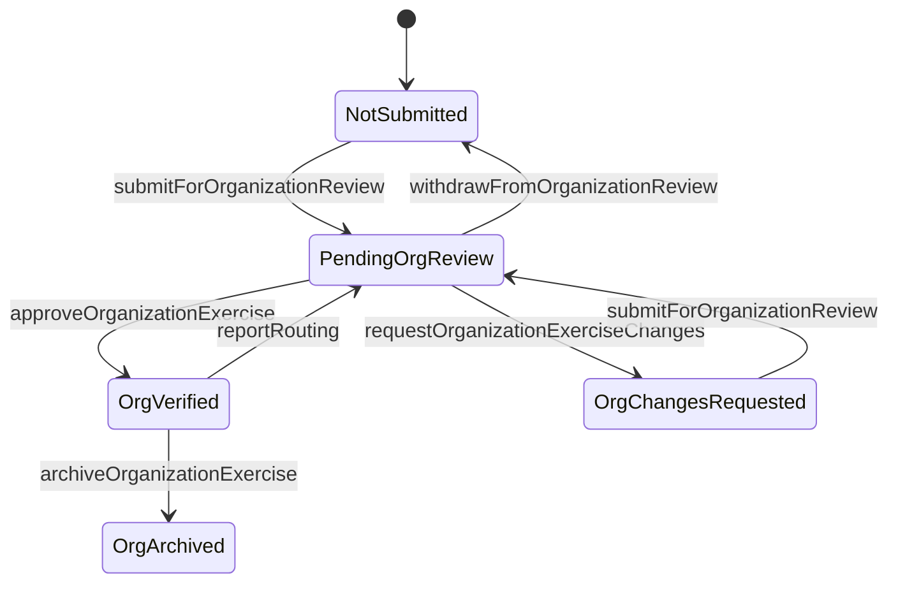

# SPEC-009: Organization Exercise Verification

## Cel biznesowy

Dziś weryfikacja ćwiczeń działa wyłącznie dla globalnej bazy FiziYo (`/verification`), a ćwiczenia organizacyjne mogą być używane bez lokalnej akceptacji jakościowej.

Celem jest dodanie równoległego flow **per-organizacja**, który:

- pozwala Owner/Admin zatwierdzać ćwiczenia organizacyjne,
- nie narusza istniejącego globalnego flow ContentManager (`submitToGlobalReview`, `approveExercise`),
- może (opcjonalnie) wymuszać publikację tylko po lokalnej weryfikacji.

## Architektura

### Główne decyzje

- Additive-first: brak breaking change dla istniejącego `ContentStatus`.
- Nowe pole na `Exercise`: `OrganizationVerificationStatus`.
- Nowe pole na `Organization`: `RequireOrganizationVerification` (domyślnie `false`).
- Bez kopiowania rekordu dla org review (in-place status transition).
- Osobne entry-pointy:
  - global: `/verification` (system roles),
  - org: `/organization/verification` (owner/admin).

### Flow

### State machine

## UI/UX Wireframes

### Admin portal

- Nowa sekcja nawigacji: `Organizacja -> Weryfikacja`.
- Lista: wariant kart/statystyk analogiczny do globalnego centrum.
- Detal: reuse układu 3-kolumnowego (`MasterVideoPlayer`, `VerificationEditorPanel`, `VerdictPanel`).
- Akcje: zatwierdź, odeślij do poprawek, archiwizuj.

### Exercises list/detail

- Status badge dla `organizationVerificationStatus`.
- CTA dla autora: `Zgłoś do weryfikacji w organizacji`.
- Lock edycji podczas `PendingOrgReview`.

### Settings

- W `ExerciseVisibilitySettings` nowy toggle:
  - `Wymagaj weryfikacji ćwiczeń w organizacji`
  - mapowanie na `Organization.RequireOrganizationVerification`.

## Interfejsy

### GraphQL Queries/Mutations

Nowe operacje backend:

- `organizationVerificationStats(organizationId: String!)`
- `organizationVerificationQueuePage(organizationId, filter, search, page, pageSize)`
- `organizationVerificationQueueNavigator(organizationId, currentExerciseId, filter, search)`
- `exerciseByIdForOrgVerification(organizationId, id)`
- `submitForOrganizationReview(exerciseId: String!)`
- `withdrawFromOrganizationReview(exerciseId: String!)`
- `approveOrganizationExercise(exerciseId: String!, reviewNotes: String)`
- `requestOrganizationExerciseChanges(exerciseId: String!, reviewNotes: String!, rejectionReason: String)`
- `archiveOrganizationExercise(exerciseId: String!, reason: String)`

Rozszerzenie istniejącej mutacji:

- `updateExerciseVisibilitySettings(..., requireOrganizationVerification: Boolean!)`

### GraphQL Contracts

Nowe pola `Exercise`:

- `organizationVerificationStatus`
- `submittedForOrgReviewAt`
- `orgReviewedBy`
- `orgReviewedAt`
- `orgReviewNotes`

Nowe pola `Organization`:

- `requireOrganizationVerification`

Zasada kompatybilności:

- globalny `ContentStatus` bez zmian semantycznych,
- nowe pola nullable lub z bezpiecznym defaultem,
- migracja additive-first.

### Komponenty

| Komponent                            | Lokalizacja                                                   | Opis                           |
| ------------------------------------ | ------------------------------------------------------------- | ------------------------------ |
| `OrganizationVerificationPage`       | `src/app/(dashboard)/organization/verification/page.tsx`      | Lista kolejki org              |
| `OrganizationVerificationDetailPage` | `src/app/(dashboard)/organization/verification/[id]/page.tsx` | Detal zadania                  |
| `VerificationStatsCards`             | `src/features/verification/VerificationStatsCards.tsx`        | Tryb `global` i `organization` |
| `VerificationTaskCard`               | `src/features/verification/VerificationTaskCard.tsx`          | Badge i metadane org           |
| `ExerciseVisibilitySettings`         | `src/components/organization/ExerciseVisibilitySettings.tsx`  | Toggle gate widoczności        |

## Data-testid

- `nav-link-org-verification`
- `org-verification-stats-pending`
- `org-verification-stats-changes`
- `org-verification-stats-verified`
- `org-verification-stats-archived`
- `exercise-card-submit-org-review-btn`
- `settings-require-org-verification-checkbox`
- `org-verification-approve-btn`
- `org-verification-request-changes-btn`

## Risk Assessment

| Ryzyko                                                         | Wplyw  | Mitigacja                                                              |
| -------------------------------------------------------------- | ------ | ---------------------------------------------------------------------- |
| Rozjechanie semantyki `ContentStatus` i nowego statusu org     | Wysoki | Twarde rozdzielenie odpowiedzialności statusów                         |
| Niezweryfikowane ORG ćwiczenia trafią do pacjenta przy gate=on | Wysoki | Walidacja w resolverach assignment i query visibility                  |
| Niespójność kontraktu admin/mobile                             | Wysoki | Jednoczesna aktualizacja fragmentów i typów w obu repo                 |
| Cross-org access leak                                          | Wysoki | Tenant scope check (`organizationId == token`) w każdym resolverze org |
| Regresja globalnego `/verification`                            | Wysoki | Brak zmian w istniejących resolverach globalnych + testy regresyjne    |

## Integration Test Coverage

| Scenariusz                                       | Typ testu    | Priorytet |
| ------------------------------------------------ | ------------ | --------- |
| Therapist submit -> Owner/Admin approve          | Integracyjny | High      |
| Therapist submit -> request changes -> resubmit  | Integracyjny | High      |
| Gate off: ORG draft nadal widoczny               | Integracyjny | High      |
| Gate on: tylko `OrgVerified` widoczny dla innych | Integracyjny | High      |
| Gate on: assignment odrzuca niezweryfikowane ORG | Integracyjny | High      |
| Brak regresji global verification flow           | Regresyjny   | High      |
| Cross-org access blocked                         | Integracyjny | High      |

## Bulk archive actions (2026-07)

Owner/Admin może zaznaczyć wiele ćwiczeń z bieżącej kolejki organizacyjnej i zarchiwizować je jedną, jawnie potwierdzoną akcją. Archiwizacja ustawia `ORG_ARCHIVED`, zachowuje rekord oraz historię recenzji i usuwa ćwiczenie wyłącznie z aktywnej kolejki. Checkbox nadrzędny zaznacza tylko ćwiczenia z aktualnie załadowanej strony.

Bulkowy kontrakt organizacyjny musi:

- wymagać `organizationId` i egzekwować zgodność z membership/token scope,
- rozróżniać sukcesy i błędy per ćwiczenie,
- odrzucać ID spoza bieżącej organizacji albo niedozwolonego stanu,
- odświeżać statystyki, kolejkę i navigator po zakończeniu operacji.

Ten sam model statusu i wyników jest używany przez wariant cross-org SiteSuperAdmin, ale wariant cross-org przyjmuje scope organizacji dla każdego elementu i nie może omijać walidacji tenant isolation.

## Changelog

### 2026-05-25

- Utworzenie specyfikacji dla per-organizacyjnej weryfikacji ćwiczeń.
- Dodanie modelu danych, state machine, kontraktów GraphQL i planu testów.

### 2026-07-11

- Dodano page-scoped bulk selection i soft-delete/archiwizację kolejki organizacyjnej.
- Doprecyzowano partial failure oraz wymagania scope/RBAC dla bulk operation.
