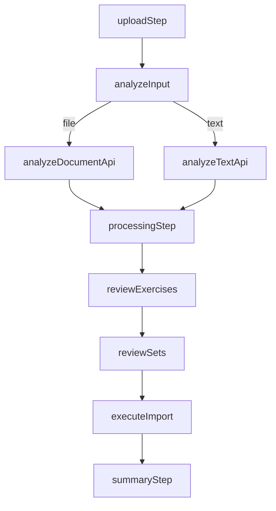

# Import Module

## Cel biznesowy

Modul importu dokumentow pozwala fizjoterapeucie szybko przeniesc tresc planu terapii do systemu FiziYo bez recznego przepisywania. Funkcja ma skrocic czas onboardingu danych i ograniczyc bledy przy tworzeniu cwiczen, zestawow i notatek klinicznych.

Wersja z 2026-03-08 rozszerza wejscie o plain-text paste, aby obsluzyc scenariusze kopiowania tresci z maila, OCR i dokumentow tekstowych bez koniecznosci zapisu pliku.

## Architektura

Import jest wizardem 5-krokowym:

1. `upload` - wybor zrodla danych (`file` albo `text`)
2. `processing` - analiza AI
3. `review-exercises` - decyzje dla cwiczen i dopasowan
4. `review-sets` - decyzje dla zestawow i notatek
5. `summary` - wynik importu

Warstwa stanu i orkiestracji:

- `src/hooks/useDocumentImport.ts` - centralny state machine wizarda
- `src/services/documentImportService.ts` - API client:
  - `POST /api/ai/document-analyze` (plik)
  - `POST /api/ai/document-analyze-text` (tekst)
  - `POST /api/ai/document-import` (zapis)

Warstwa UI:

- `src/app/(dashboard)/import/page.tsx` - strona i stepper
- `src/features/import/DocumentDropzone.tsx` - ingress plikowy
- `src/features/import/TextImportPanel.tsx` - ingress plain text
- `src/features/import/ImportReviewDashboard.tsx` + sekcje/karty review
- `src/features/import/PatientContextPanel.tsx` - kontekst pacjenta dla notatek

## UI/UX Wireframes

- Naglowek `Import dokumentow` z badge `Eksperymentalne`
- Karta informacyjna: wyniki sa best-effort, wymagaja review przed importem
- Tabs na kroku `upload`:
  - `Przeslij plik`
  - `Wklej tekst`
- Tryb tekstowy jest clipboard-first:
  - textarea (manual paste)
  - przycisk `Wklej ze schowka` (Clipboard API + fallback)
  - licznik znakow i walidacja minimalnej dlugosci
- Dalsze kroki review/import pozostaja wspolne dla obu zrodel

## Interfejsy

### GraphQL Queries/Mutations

Brak bezposrednich zmian GraphQL po stronie frontendu. Modul importu korzysta z endpointow HTTP backendu AI.

### Contracts HTTP

#### `POST /api/ai/document-analyze`

- input: `multipart/form-data` (`file`, opcjonalnie `patientId`, `additionalContext`)
- output: `DocumentAnalysisResult`

#### `POST /api/ai/document-analyze-text`

- input: JSON `{ text, patientId?, additionalContext? }`
- output: `DocumentAnalysisResult`

#### `POST /api/ai/document-import`

- input: `DocumentImportRequest`
- output: `DocumentImportResult`

### Komponenty

| Komponent               | Lokalizacja                                     | Opis                               |
| ----------------------- | ----------------------------------------------- | ---------------------------------- |
| `ImportPage`            | `src/app/(dashboard)/import/page.tsx`           | Kontener strony i nawigacja krokow |
| `DocumentDropzone`      | `src/features/import/DocumentDropzone.tsx`      | Wejscie plikowe                    |
| `TextImportPanel`       | `src/features/import/TextImportPanel.tsx`       | Wejscie tekstowe i clipboard flow  |
| `ImportReviewDashboard` | `src/features/import/ImportReviewDashboard.tsx` | Review cwiczen i bulk actions      |
| `PatientContextPanel`   | `src/features/import/PatientContextPanel.tsx`   | Wybieranie pacjenta pod notatki    |
| `ImportSummary`         | `src/features/import/ImportSummary.tsx`         | Wynik i restart flow               |

## Data-testid

- `import-experimental-badge`
- `import-experimental-note`
- `import-input-mode-tabs`
- `import-mode-file-tab`
- `import-mode-text-tab`
- `import-text-panel`
- `import-textarea-input`
- `import-text-clipboard-btn`
- `import-text-char-count`

## Risk Assessment

| Ryzyko                                      | Wplyw                                                       | Mitigacja                                                            |
| ------------------------------------------- | ----------------------------------------------------------- | -------------------------------------------------------------------- |
| Niespojny stan po przelaczaniu `file/text`  | Uzytkownik moze analizowac zly input lub widziec stary blad | Reset bledow i wynikow analizy przy zmianie trybu                    |
| Clipboard API odrzucone przez przegladarke  | Brak automatycznego wklejania                               | Manual textarea jako glowna sciezka, komunikat fallback              |
| Regresja flow plikowego po refaktorze hooka | Blokada kluczowego przypadku importu                        | Wspolny orchestrator `analyzeInput`, testy hooka dla `file` i `text` |
| Rozszerzenie test IDs bez dokumentacji      | Trudniejsza automatyzacja E2E                               | Aktualizacja `docs/testing/data-testid-map.md`                       |

## Integration Test Coverage

| Scenariusz                                                    | Typ testu                      | Priorytet |
| ------------------------------------------------------------- | ------------------------------ | --------- |
| Analiza z pliku przechodzi do `processing` i dalej do review  | Unit/integration (hook + page) | High      |
| Analiza z tekstu przechodzi do `processing` i dalej do review | Unit/integration (hook + page) | High      |
| Przelaczenie miedzy `file` i `text` czysci stary blad         | Unit (hook)                    | High      |
| Clipboard API failure nie blokuje manualnego paste            | Integration (UI)               | Medium    |

## Changelog

### 2026-03-08

- Utworzenie specyfikacji modułu importu.
- Dodanie architektury dla dual input (`file` + `text`) i statusu eksperymentalnego.
