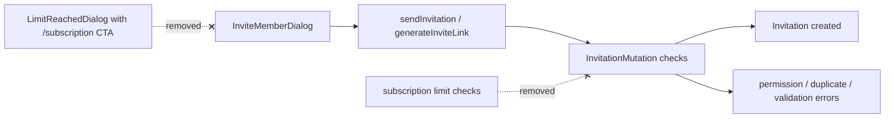

# Invite Flow Without Legacy Plan Limits

## Cel biznesowy

Zaproszenia członków zespołu (`sendInvitation`, `generateInviteLink`) nie mogą być blokowane przez nieaktywny model subskrypcji `Starter/Solo/Pro/Business`, bo aktywny model monetyzacji to revenue-share. Użytkownik ma widzieć neutralne błędy domenowe zamiast komunikatów o upgrade planu.

## Architektura

## UI/UX Wireframes

- `InviteMemberDialog` wyświetla tylko neutralne komunikaty błędów.
- Dla legacy kodów limitu (`THERAPIST_LIMIT_REACHED`, `PATIENT_LIMIT_REACHED`, `EXERCISE_LIMIT_REACHED`, `CLINIC_LIMIT_REACHED`) pokazujemy ogólny komunikat techniczny bez słów `Starter`, `Pro`, `upgrade`.
- Aktywne CTA finansowe prowadzą do `/finances` (bez pośrednich linków `/billing`).

## Interfejsy

### GraphQL Queries/Mutations

- `SendInvitation(organizationId, email, role, message)`
- `GenerateInviteLink(organizationId, role, expirationDays)`

### GraphQL Contracts

- Brak zmian shape odpowiedzi mutacji.
- Zmieniona semantyka walidacji backendowej: brak rzucania `THERAPIST_LIMIT_REACHED` dla zaproszeń.
- Zgodność wsteczna utrzymana: istniejące pola response i input pozostają bez zmian.

### Komponenty

| Komponent          | Lokalizacja                                                                | Opis                                                         |
| ------------------ | -------------------------------------------------------------------------- | ------------------------------------------------------------ |
| InviteMemberDialog | `src/components/organization/InviteMemberDialog.tsx`                       | Neutralna obsługa błędów invite i brak legacy modalu limitów |
| OrganizationPage   | `src/app/(dashboard)/organization/page.tsx`                                | Usunięcie nieużywanego pobierania planu z flow zespołu       |
| TeamSection        | `src/components/organization/TeamSection.tsx`                              | Uproszczenie propsów o legacy limity                         |
| InvitationMutation | `d:/Prezentytu/fizjo-app/backend/FizjoApp.Api/Types/InvitationMutation.cs` | Usunięcie checks `maxTherapists` z invite flow               |

## Data-testid

- `org-invite-tab-link`
- `org-invite-generate-link-btn`
- `org-invite-send-btn`

## Risk Assessment

| Ryzyko                                                     | Wplyw  | Mitigacja                                                                           |
| ---------------------------------------------------------- | ------ | ----------------------------------------------------------------------------------- |
| Ukryte zależności od starych limitów w innych resolverach  | Średni | Audyt ścieżek `addMember` i `resendInvitation` + testy manualne                     |
| Powrót starych CTA `/subscription` przez komponenty legacy | Średni | Odcinanie eksportów legacy i test regresji invite dialogu                           |
| Niespójność frontend-backend po częściowym deployu         | Wysoki | Najpierw hotfix frontend, następnie deploy backend; komunikacja o manualnym deployu |

## Integration Test Coverage

| Scenariusz                                                                           | Typ testu             | Priorytet |
| ------------------------------------------------------------------------------------ | --------------------- | --------- |
| `generateInviteLink` zwraca stary kod limitu i UI pokazuje neutralny komunikat       | Frontend komponentowy | High      |
| standardowy błąd GraphQL invite pokazuje message z API                               | Frontend komponentowy | Medium    |
| `sendInvitation` i `generateInviteLink` nie rzucają limitu planu po stronie backendu | Backend integracyjny  | High      |
| zaakceptowanie zaproszenia i lista zaproszeń działają po zmianie                     | E2E/regresja          | High      |

## Changelog

### 2026-03-08

- Dodano spec dla usunięcia legacy limitów z invite flow.
- Uporządkowano granicę między aktywnym modelem revenue-share a nieaktywnym modelem planów organizacji.
