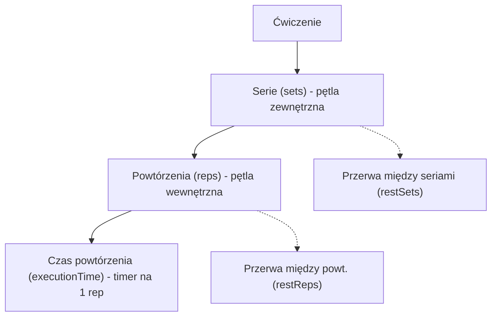

# Exercise Dosage Model (Single Source of Truth)

## Cel biznesowy

W całej platformie FiziYo (admin + backend + mobile) parametry czasu muszą mieć jednoznaczną semantykę. Obecnie terapeuci i kod mieszają `duration` (czas serii) z `executionTime` (czas powtórzenia), co prowadzi do błędnych etykiet, niespójnych presetów i regresji UX.

Ta specyfikacja definiuje jeden model domenowy dawkowania, który jest źródłem prawdy dla:
- formularzy create/edit,
- override w assignment/pacjent,
- importu,
- kontraktów GraphQL i backendowych walidacji.

## Architektura

### Kanoniczny model wykonania

```text
Serie (sets) × Powtórzenia (reps) [× Czas powtórzenia (executionTime)]
```

Hierarchia pętli:



### Definicje pól

| Warstwa | Pole | Znaczenie |
| --- | --- | --- |
| Backend | `DefaultSets` | Ile razy wykonujemy pełny blok powtórzeń (pętla serii) |
| Backend | `DefaultReps` | Ile powtórzeń w jednej serii |
| Backend | `DefaultExecutionTime` | Czas jednego powtórzenia w sekundach; `> 0` aktywuje timer w appce pacjenta |
| Backend | `DefaultDuration` | Czas serii w sekundach; pole legacy/override, nie główny parametr wejściowy |
| Frontend | `sets` | Alias `DefaultSets` |
| Frontend | `reps` | Alias `DefaultReps` |
| Frontend | `executionTime` | Alias `DefaultExecutionTime` |
| Frontend | `duration` | Alias `DefaultDuration` |

### Reguła czasu serii

W modelu reps-based czas serii jest wartością wyliczaną:

```text
seriesTime = reps × executionTime + (reps - 1) × restReps
```

W modelu time-based (`ExerciseType.Time`) `duration` może być ustawione ręcznie jako override czasu serii.

## UI/UX Wireframes

### Kreator i formularze

- TIER 1: `Serie`, `Powtórzenia`, `Czas powtórzenia`.
- `Czas serii` jest wyświetlany jako computed summary (readonly) albo w sekcji zaawansowanej jako time-based override.
- Nie używamy ogólnej etykiety `Czas`.

### Przykłady kanoniczne

| Scenariusz | sets | reps | executionTime | duration | Interpretacja |
| --- | --- | --- | --- | --- | --- |
| Klasyczne siłowe | 3 | 10 | null | null | `3 × 10` |
| Tempo z timerem | 3 | 10 | 4 | null | `3 × 10 × 4s` |
| Plank prosty | 3 | 1 | 30 | null | `3 × 1 × 30s` |
| Plank złożony | 2 | 3 | 45 | null | `2 × 3 × 45s` |
| Time-based override | 3 | null | null | 60 | `3 × 60s` |

## Interfejsy

### GraphQL Queries/Mutations

Bez zmian nazw operacji:
- `CREATE_EXERCISE_MUTATION`
- `UPDATE_EXERCISE_MUTATION`
- `UPDATE_EXERCISE_IN_SET_MUTATION`
- `UPDATE_PATIENT_EXERCISE_OVERRIDES_MUTATION`

### GraphQL Contracts

- `executionTime` i `duration` pozostają polami addytywnymi i niezależnymi.
- `executionTime` jest domyślnym parametrem czasu dla większości flow.
- `duration` pozostaje kompatybilnym polem legacy/override dla przypadków time-based.
- Brak breaking change w kontraktach API.

### Reguła inferencji `type`

- `duration > 0 && (reps == null || reps <= 0)` -> `ExerciseType.Time`
- Pozostałe przypadki -> `ExerciseType.Reps`
- Backend nie inferuje typu z samych pól czasu; frontend przesyła `type` jawnie.

### Komponenty objęte standaryzacją

| Komponent | Lokalizacja | Kontrakt |
| --- | --- | --- |
| Create wizard | `src/features/exercises/CreateExerciseWizard.tsx` | TIER 1 używa `executionTime`; `duration` tylko advanced/override |
| Edit form | `src/features/exercises/ExerciseForm.tsx` | Identyczna semantyka jak wizard |
| Shared registry | `src/components/shared/exercise/displayRegistry.ts` | Jedno źródło etykiet i tooltipów |
| Patient overrides | `src/features/patients/EditExerciseOverrideDialog.tsx` | Obsługa obu pól: `duration` i `executionTime` |
| Assignment card | `src/features/patients/PatientAssignmentCard.tsx` | Etykiety jawne: `Czas serii`, `Czas powt.` |
| Import cards | `src/features/import/cards/*.tsx` | Brak etykiety ogólnej `Czas` |

## Data-testid

- `exercise-create-series-time-summary`
- `exercise-create-series-time-value`
- `exercise-create-exec-time-input`
- `exercise-create-duration-input`
- `patient-exercise-override-duration-input`
- `patient-exercise-override-execution-time-input`

## Risk Assessment

| Ryzyko | Wpływ | Mitigacja |
| --- | --- | --- |
| Część flow nadal traktuje `duration` jako główne pole | Wysoki | Przepięcie wszystkich powierzchni z mapy standaryzacji + testy regresyjne |
| Presety czasowe zmienią zachowanie istniejących userów | Średni | Jasny copy i migration note w changelog |
| Rozjazd helperów czasu (`exerciseTime` vs `calculateSeriesTime`) | Średni | Ujednolicenie formuł i testy jednostkowe |
| Niespójność admin vs backend po częściowym wdrożeniu | Wysoki | Wdrożenie addytywne i zachowanie kompatybilności kontraktów |

## Integration Test Coverage

| Scenariusz | Typ testu | Priorytet |
| --- | --- | --- |
| Create wizard: `2 × 3 × 45s` pokazuje poprawny `Czas serii` i payload `executionTime=45` | Komponentowy | High |
| AIDiffDrawer: `duration` jest oznaczone jako `Czas serii`, `executionTime` jako `Czas powtórzenia` | Komponentowy | High |
| Patient override: można zapisać osobno `duration` i `executionTime` | Integracyjny | High |
| Import cards: brak ogólnego labela `Czas` | Komponentowy | Medium |
| Helper czasu: formuła z `restReps` nie regresuje | Jednostkowy | High |

## Changelog

### 2026-04-08

- Utworzono specyfikację `SPEC-012` jako Single Source of Truth dla semantyki `duration` vs `executionTime`.
- Zdefiniowano kanoniczny model `Serie × Powtórzenia × Czas powtórzenia`.
- Ustalono regułę inferencji `ExerciseType` i mapę powierzchni UI do standaryzacji.
