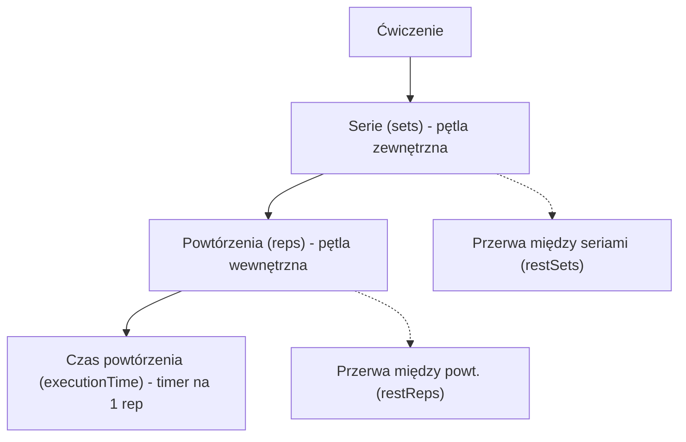

# Exercise Dosage Model (Single Source of Truth)

## Cel biznesowy

W całej platformie FiziYo (admin + backend + mobile) parametry czasu muszą mieć jednoznaczną semantykę. Obecnie terapeuci i kod mieszają `duration` (czas serii) z `executionTime` (czas powtórzenia), co prowadzi do błędnych etykiet, niespójnych presetów i regresji UX.

Ta specyfikacja definiuje jeden model domenowy podstawowych parametrów wykonania, który jest źródłem prawdy dla:

- formularzy create/edit,
- override w assignment/pacjent,
- importu,
- kontraktów GraphQL i backendowych walidacji.

## Architektura

### Kanoniczny model wykonania

```text
Serie (sets) × Powtórzenia (reps) [× Czas powtórzenia (executionTime)]
```

Hierarchia pętli:


```mermaid
graph TD
  Exercise["Ćwiczenie"]
  Sets["Serie (sets) - pętla zewnętrzna"]
  Reps["Powtórzenia (reps) - pętla wewnętrzna"]
  ExecTime["Czas powtórzenia (executionTime) - timer na 1 rep"]
  RestSets["Przerwa między seriami (restSets)"]
  RestReps["Przerwa między powt. (restReps)"]

  Exercise --> Sets
  Sets --> Reps
  Reps --> ExecTime
  Sets -.-> RestSets
  Reps -.-> RestReps
```

### Definicje pól

| Warstwa  | Pole                   | Znaczenie                                                                   |
| -------- | ---------------------- | --------------------------------------------------------------------------- |
| Backend  | `DefaultSets`          | Ile razy wykonujemy pełny blok powtórzeń (pętla serii)                      |
| Backend  | `DefaultReps`          | Ile powtórzeń w jednej serii                                                |
| Backend  | `DefaultExecutionTime` | Czas jednego powtórzenia w sekundach; `> 0` aktywuje timer w appce pacjenta |
| Backend  | `DefaultDuration`      | Czas serii w sekundach; pole legacy/override, nie główny parametr wejściowy |
| Frontend | `sets`                 | Alias `DefaultSets`                                                         |
| Frontend | `reps`                 | Alias `DefaultReps`                                                         |
| Frontend | `executionTime`        | Alias `DefaultExecutionTime`                                                |
| Frontend | `duration`             | Alias `DefaultDuration`                                                     |

### Reguła czasu serii

W modelu reps-based czas serii jest wartością wyliczaną:

```text
seriesTime = reps × executionTime + (reps - 1) × restReps
```

W modelu time-based (`ExerciseType.Time`) `duration` może być ustawione ręcznie jako override czasu serii.

## UI/UX Wireframes

### Kreator i formularze

- TIER 1: `Serie`, `Powtórzenia`, `Czas powtórzenia`.
- `Czas serii` jest wyświetlany jako computed summary (readonly) albo w sekcji zaawansowanej jako time-based override.
- Nie używamy ogólnej etykiety `Czas`.

### Przykłady kanoniczne

| Scenariusz          | sets | reps | executionTime | duration | Interpretacja |
| ------------------- | ---- | ---- | ------------- | -------- | ------------- |
| Klasyczne siłowe    | 3    | 10   | null          | null     | `3 × 10`      |
| Tempo z timerem     | 3    | 10   | 4             | null     | `3 × 10 × 4s` |
| Plank prosty        | 3    | 1    | 30            | null     | `3 × 1 × 30s` |
| Plank złożony       | 2    | 3    | 45            | null     | `2 × 3 × 45s` |
| Time-based override | 3    | null | null          | 60       | `3 × 60s`     |

## Interfejsy

### GraphQL Queries/Mutations

Bez zmian nazw operacji:

- `CREATE_EXERCISE_MUTATION`
- `UPDATE_EXERCISE_MUTATION`
- `UPDATE_EXERCISE_IN_SET_MUTATION`
- `UPDATE_PATIENT_EXERCISE_OVERRIDES_MUTATION`

### GraphQL Contracts

- `executionTime` i `duration` pozostają polami addytywnymi i niezależnymi.
- `executionTime` jest domyślnym parametrem czasu dla większości flow.
- `duration` pozostaje kompatybilnym polem legacy/override dla przypadków time-based.
- Brak breaking change w kontraktach API.

### Reguła inferencji `type`

- `duration > 0 && (reps == null || reps <= 0)` -> `ExerciseType.Time`
- Pozostałe przypadki -> `ExerciseType.Reps`
- Backend nie inferuje typu z samych pól czasu; frontend przesyła `type` jawnie.

### Komponenty objęte standaryzacją

| Komponent         | Lokalizacja                                                | Kontrakt                                                           |
| ----------------- | ---------------------------------------------------------- | ------------------------------------------------------------------ |
| Create wizard     | `src/features/exercises/CreateExerciseWizard.tsx`          | Lean subset z `fieldContract` (TIER 1–2 widoczne, 3–4 collapsible) |
| Shared editor     | `src/features/exercises/ExerciseEditor.tsx`                | Pełny edytor szablonu (detal, dialog, weryfikacja)                 |
| Parameters editor | `src/features/exercises/ExerciseParametersEditor.tsx`      | Render z `fieldContract` — parametry wykonania                     |
| Field contract    | `src/components/shared/exercise/fieldContract.ts`          | SSOT: etykiety, tier, surfaces, zod, options                       |
| Shared registry   | `src/components/shared/exercise/displayRegistry.ts`        | SSOT etykiet i tooltipów (read-only)                               |
| Mapping card      | `src/components/shared/exercise/ExerciseExecutionCard.tsx` | Parametry mappingu z `surfaces: mapping`                           |
| Patient overrides | `src/features/patients/EditExerciseOverrideDialog.tsx`     | Parametry z `surfaces: patientOverride` + dziedziczenie            |
| Assignment card   | `src/features/patients/PatientAssignmentCard.tsx`          | Etykiety jawne: `Czas serii`, `Czas powt.`                         |
| Import cards      | `src/features/import/cards/*.tsx`                          | Brak etykiety ogólnej `Czas`                                       |

## Field Contract

Jedno źródło prawdy dla semantyki pól edycyjnych. Powierzchnia derywuje **podzbiór i layout**, nigdy etykietę, walidację ani mapowanie na mutację.

Kod: `src/components/shared/exercise/fieldContract.ts` (+ `displayRegistry.ts` dla etykiet read-only).

### Reguła derywacji create-jako-podzbiór

- Create (`CreateExerciseWizard`) = jawny podzbiór pól szablonu w tej samej kolejności i grupach.
- TIER 1–2 widoczne od razu; TIER 3–4 w sekcji zaawansowanej.
- Sekcje rozszerzone (enrichment v3: typowe błędy, kroki, bezpieczeństwo) **nie** są w kreatorze — po zapisie CTA „Dokończ opis” prowadzi na detal.
- Dialog edycji i detal/weryfikacja używają tego samego `ExerciseEditor` + `useExerciseEditorForm`.

### Macierz `pole × powierzchnia`

| Pole                  | template | mapping   | patientOverride | Czytane przez                                | Uwagi                                      |
| --------------------- | -------- | --------- | --------------- | -------------------------------------------- | ------------------------------------------ |
| `sets`                | edit     | edit      | edit            | exerciseSets / patientAssignments / adapter  | TIER 1                                     |
| `reps`                | edit     | edit      | edit            | j.w.                                         | TIER 1                                     |
| `executionTime`       | edit     | edit      | edit            | j.w. (+ response mutacji mapping)            | TIER 1 — timer pacjenta                    |
| `restSets`            | edit     | edit      | edit            | j.w.                                         | TIER 2                                     |
| `load` / `loadKg`     | edit     | edit      | edit\*          | j.w. (load na mappingu w patientAssignments) | TIER 2; JSON override: `loadWeightKg`      |
| `restReps`            | edit     | edit      | edit            | j.w.                                         | TIER 3 / 4                                 |
| `preparationTime`     | edit     | edit      | edit\*          | exerciseSets + mapping mutacji; adapter      | Potwierdzone w GraphQL mapping             |
| `tempo`               | edit     | edit      | edit\*          | j.w.                                         | TIER 3                                     |
| `side`                | edit     | inherited | edit            | Exercise + override `exerciseSide`           | persistence: assignmentOverride (SPEC-021) |
| `rangeOfMotion`       | edit     | —         | edit\*          | Exercise + override                          | persistence: assignmentOverride            |
| `difficultyLevel`     | edit     | —         | edit\*\*        | Exercise + override                          | persistence: assignmentOverride (SPEC-021) |
| `duration`            | edit     | edit      | edit            | j.w.                                         | TIER 4                                     |
| `patientDescription`  | edit     | —         | edit\*\*        | Exercise + override                          | persistence: assignmentOverride (SPEC-021) |
| `clinicalDescription` | edit     | —         | edit\*\*        | Exercise + override                          | persistence: assignmentOverride (SPEC-021) |
| `audioCue`            | edit     | —         | edit\*\*        | Exercise + override                          | persistence: assignmentOverride (SPEC-021) |
| `notes`               | edit     | edit      | edit            | j.w.                                         |                                            |
| `customName`          | —        | edit      | edit            | mapping / override                           |                                            |
| `customDescription`   | —        | edit      | edit            | mapping / override                           |                                            |

\* Pola oznaczone gwiazdką w `patientOverride` wymagają potwierdzenia odczytu w fizjo-app (JSON `exerciseOverrides`). Feature-flag: `ENABLE_EXTENDED_PATIENT_OVERRIDE_FIELDS`.
\*\* Pełna personalizacja (SPEC-021): `ENABLE_FULL_PATIENT_PERSONALIZATION`. Powierzchnia UI `patientPlan` = mapping ∪ assignmentOverride.

**Precedencja odczytu (SSOT):** `resolveEffectiveExerciseParams` — `override > mapping > szablon`. Pole w mutacji bez ścieżki odczytu = bug.

**Routing zapisu (SPEC-021):** `fieldContract.persistence` ∈ `mapping` \| `assignmentOverride` \| `templateOnly`. Writer: `exercisePersonalizationWriter.ts`.

### Gate: rozszerzenie JSON `exerciseOverrides`

Nadpisania per pacjent lecą jako JSON przez `UPDATE_PATIENT_EXERCISE_OVERRIDES_MUTATION` i są konsumowane przez fizjo-app. Rozszerzenie o `tempo`, `loadWeightKg`, `preparationTime`, `rangeOfMotion`, `difficultyLevel`, `patientDescription`, `clinicalDescription`, `audioCue` jest **zmianą kontraktu cross-repo**.

- SSOT kluczy: `src/components/shared/exercise/exerciseOverride.ts` (`ExerciseOverrideFields`).
- UI pacjenta eksponuje extended fields gdy `ENABLE_EXTENDED_PATIENT_OVERRIDE_FIELDS === true`.
- Pełna personalizacja: `ENABLE_FULL_PATIENT_PERSONALIZATION === true`.
- Klucze JSON: `sets`, `reps`, `duration`, `executionTime`, `restSets`, `restReps`, `preparationTime`, `tempo`, `loadWeightKg`, `rangeOfMotion`, `exerciseSide`, `difficultyLevel`, `patientDescription`, `clinicalDescription`, `audioCue`, `customName`, `customDescription`, `notes`, `customImages`, `hidden`.

## Data-testid

### Create / shared parameters

- `exercise-create-exec-time-input` (legacy alias w kreatorze; kanoniczny: `exercise-param-executionTime-input`)
- `exercise-param-series-time` — computed „Czas serii”
- `exercise-param-total-time` — computed „Czas trwania ćwiczenia”
- `exercise-param-{field}-input` — pola numeryczne/tekstowe z `ExerciseParametersEditor`
- `exercise-param-{field}-select` — selecty (side, difficulty)
- `exercise-create-duration-badge` — badge czasu w kreatorze (legacy)

### Patient override

- `patient-exercise-override-duration-input`
- `patient-exercise-override-execution-time-input`
- `patient-exercise-override-sets-input`
- `patient-exercise-override-reps-input`
- `patient-exercise-override-rest-sets-input`
- `patient-exercise-override-rest-reps-input`
- `patient-exercise-override-submit-btn`

## Risk Assessment

| Ryzyko                                                           | Wpływ  | Mitigacja                                                                 |
| ---------------------------------------------------------------- | ------ | ------------------------------------------------------------------------- |
| Część flow nadal traktuje `duration` jako główne pole            | Wysoki | Przepięcie wszystkich powierzchni z mapy standaryzacji + testy regresyjne |
| Presety czasowe zmienią zachowanie istniejących userów           | Średni | Jasny copy i migration note w changelog                                   |
| Rozjazd helperów czasu (`exerciseTime` vs `calculateSeriesTime`) | Średni | Ujednolicenie formuł i testy jednostkowe                                  |
| Niespójność admin vs backend po częściowym wdrożeniu             | Wysoki | Wdrożenie addytywne i zachowanie kompatybilności kontraktów               |

## Integration Test Coverage

| Scenariusz                                                                                         | Typ testu    | Priorytet |
| -------------------------------------------------------------------------------------------------- | ------------ | --------- |
| Create wizard: `2 × 3 × 45s` pokazuje poprawny `Czas serii` i payload `executionTime=45`           | Komponentowy | High      |
| AIDiffDrawer: `duration` jest oznaczone jako `Czas serii`, `executionTime` jako `Czas powtórzenia` | Komponentowy | High      |
| Patient override: można zapisać osobno `duration` i `executionTime`                                | Integracyjny | High      |
| Import cards: brak ogólnego labela `Czas`                                                          | Komponentowy | Medium    |
| Helper czasu: formuła z `restReps` nie regresuje                                                   | Jednostkowy  | High      |

## Changelog

### 2026-07-28 (Mapping Field Parity)

- Macierz rozszerzona o kolumnę „Czytane przez”; `preparationTime` na mappingu = edit (mutacja + query).
- SSOT odczytu: `resolveEffectiveExerciseParams` + `ExerciseOverrideFields` (klucze SPEC-012).
- Mutacje mapping zwracają `preparationTime`/`executionTime`; fragmenty patientAssignments pobierają load.

### 2026-07-28 (Field Contract)

- Dodano sekcję Field Contract: macierz `pole × powierzchnia`, reguła create-jako-podzbiór, gate cross-repo na rozszerzenie JSON `exerciseOverrides`.
- Zsynchronizowano data-testid ze stanem kodu (`exercise-param-*`, `exercise-create-duration-badge`); usunięto nieistniejące ID ze spec.
- SSOT edycji: `src/components/shared/exercise/fieldContract.ts` (etykiety z `displayRegistry`).

### 2026-07-28

- Create i duplicate korzystają ze wspólnego `inferExerciseType` (reguła timerowa: `executionTime > 0` → `time`) w `buildCreateExerciseVariables`.
- Etykieta przerwy w TIER1 create doprecyzowana do „Przerwa serii” (tooltip: przerwa między seriami).

### 2026-04-08

- Utworzono specyfikację `SPEC-012` jako Single Source of Truth dla semantyki `duration` vs `executionTime`.
- Zdefiniowano kanoniczny model `Serie × Powtórzenia × Czas powtórzenia`.
- Ustalono regułę inferencji `ExerciseType` i mapę powierzchni UI do standaryzacji.
