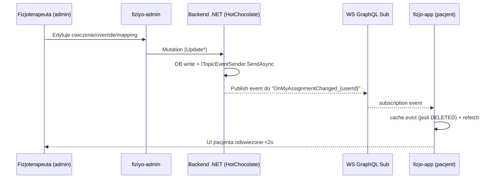

# Real-time Patient Assignment Sync (admin -> mobile)

## Cel biznesowy

Po edycji cwiczenia, override lub mappingu w panelu administracyjnym FiziYo
fizjoterapeuta oczekuje, ze pacjent zobaczy zmiane w aplikacji mobilnej w czasie
rzeczywistym (typowo `<2s`). Brak tej propagacji prowadzi do sytuacji, w ktorej
pacjent wykonuje stare ćwiczenia i nie widzi korekt.

## Diagnoza pierwotna

Bug "po aktualizacji cwiczenia w zestawie spersonalizowanym pacjent nie widzi
zmian" powstaje na piec nakladajacych sie warstw:

1. **Mobile bez WebSocket linku** - `apolloClientFactory.ts` mial tylko HTTP chain.
2. **Backend bez emisji eventow** dla zmian per-pacjent - tylko `OnAssignmentUpdated`
   per-org dla admina, brak granularnego topiku dla pacjenta.
3. **Mobile cache-first + brak refetch on focus** - widok `sets/index.tsx` nie
   refetchowal `GetMyExerciseSets` przy powrocie na ekran.
4. **"Intelligent merge" cache** - ExerciseSet.exerciseMappings zachowywalo
   istniejace dane gdy incoming pusty, utrwalajac stale data.
5. **Admin: niekompletny update + brakujace refetch** - `buildExerciseUpdateVariables`
   pomijal pola; `AssignmentWizard.handleEditSubmit` nie awaitowal refetchow.

## Architektura docelowa



## Faza 1 - Quick fix (no backend)

### 1.1 Mobile (`fizjo-app`)

| Plik                                         | Zmiana                                                                                                                                     |
| -------------------------------------------- | ------------------------------------------------------------------------------------------------------------------------------------------ |
| `src/graphql/client/apolloClientFactory.ts`  | `exerciseMappings.merge` zwraca `incoming` (nie zachowuje `existing` przy pustym). Default `watchQuery.fetchPolicy` = `cache-and-network`. |
| `src/graphql/hooks/usePatientAssignments.ts` | `useQuery(GET_PATIENT_ASSIGNMENTS_BY_USER_QUERY)` z `fetchPolicy: 'cache-and-network'`.                                                    |
| `app/(tabs)/patient/sets/index.tsx`          | `useFocusEffect` wymusza `refetchAssignments + refetchProgress`. Pull-to-refresh przez `RefreshControl`.                                   |
| `app/(tabs)/patient/sets/[id].tsx`           | `useFocusEffect` woła `refetchAssignment + refetchProgress`.                                                                               |
| `app/(tabs)/patient/sets/details/[id].tsx`   | Dodanie `useFocusEffect` z `refetchAssignment`.                                                                                            |

### 1.2 Admin (`fiziyo-admin`)

| Plik                                                                          | Zmiana                                                                                                                                             |
| ----------------------------------------------------------------------------- | -------------------------------------------------------------------------------------------------------------------------------------------------- |
| `src/features/exercises/ExerciseForm.tsx`                                     | Schema rozszerzona o passthrough: `mainTags`, `additionalTags`, `difficultyLevel`, `loadType/Value/Unit/Text`.                                     |
| `src/features/exercises/ExerciseDialog.tsx`                                   | `defaultValues` zachowuje istniejace tagi z `exercise` (helper `normalizeTagIds`).                                                                 |
| `src/features/exercises/utils/buildExerciseUpdateVariables.ts`                | Mapuje wszystkie pola z `UPDATE_EXERCISE_MUTATION`. Pola passthrough wysylane jako `undefined` gdy puste -> backend zachowuje istniejace wartosci. |
| `src/features/exercises/utils/__tests__/buildExerciseUpdateVariables.test.ts` | 7 testow (regresja kontraktu).                                                                                                                     |
| `src/features/assignment/AssignmentWizard.tsx`                                | `useApolloClient` + `awaitRefetchQueries: true` na kazdej mutacji w `handleEditSubmit` + final `client.refetchQueries` po petli.                   |

## Faza 2 - Backend (.NET / HotChocolate)

Status: **DO WDROZENIA** w backend repo. Pelny kontrakt:
[`docs/backend/realtime-patient-sync-contract.md`](../../docs/backend/realtime-patient-sync-contract.md).

### Schema GraphQL

```graphql
type AssignmentChangeEvent {
  assignmentId: String!
  userId: String!
  changeType: AssignmentChangeType!
  exerciseSetId: String
  mappingId: String
  exerciseId: String
  changedAt: DateTime!
}

enum AssignmentChangeType {
  ASSIGNMENT_CREATED
  ASSIGNMENT_UPDATED
  ASSIGNMENT_DELETED
  OVERRIDES_UPDATED
  MAPPING_ADDED
  MAPPING_UPDATED
  MAPPING_REMOVED
  EXERCISE_TEMPLATE_UPDATED
}

extend type Subscription {
  onMyAssignmentChanged: AssignmentChangeEvent!
}
```

### Resolver (HotChocolate)

```csharp
[Subscribe(With = nameof(SubscribeToMyAssignmentChanged))]
[Authorize]
public AssignmentChangeEvent OnMyAssignmentChanged(
    [EventMessage] AssignmentChangeEvent payload) => payload;

public ValueTask<ISourceStream<AssignmentChangeEvent>> SubscribeToMyAssignmentChanged(
    [Service] ITopicEventReceiver receiver,
    [GlobalState("currentUserId")] string userId,
    CancellationToken ct)
    => receiver.SubscribeAsync<AssignmentChangeEvent>($"OnMyAssignmentChanged_{userId}", ct);
```

### Bezpieczenstwo

- `[Authorize]` + `[GlobalState("currentUserId")]` -> userId pobierany z JWT.
- Topic skopowany per-user, klient nie moze podsluchac cudzego topiku.

### Emisja z handlerow mutacji

Szczegolowa tabela mutacja -> odbiorcy w
`docs/backend/realtime-patient-sync-contract.md` sekcja 4.

## Faza 3 - Mobile WebSocket integration

| Plik                                                             | Zmiana                                                                                                                                       |
| ---------------------------------------------------------------- | -------------------------------------------------------------------------------------------------------------------------------------------- |
| `package.json`                                                   | Dodano `graphql-ws`, `graphql`.                                                                                                              |
| `src/graphql/config/urlConfig.ts`                                | `getGraphQLWsEndpoint()` konwertuje http(s) -> ws(s).                                                                                        |
| `src/graphql/links/wsLink.ts` (nowy)                             | `WsLinkFactory` z `lazy: true`, `retryAttempts: Infinity`, `keepAlive: 10s`, `connectionParams` jako funkcja (token przy kazdej rekonekcji). |
| `src/graphql/client/apolloClientFactory.ts`                      | `ApolloLink.split` rozdziela subscription -> WS, query/mutation -> HTTP chain. Sterowane `enableSubscriptions`.                              |
| `src/graphql/subscriptions/myAssignment.subscriptions.ts` (nowy) | `ON_MY_ASSIGNMENT_CHANGED_SUBSCRIPTION` + typy.                                                                                              |
| `src/graphql/hooks/useRealtimeMyAssignments.ts` (nowy)           | `useSubscription` + debounced refetch (300ms) + AppState listener.                                                                           |
| `providers/ApolloProvider.tsx`                                   | `RealtimeBridge` mountuje hook globalnie wewnatrz Apollo Provider, sterowany feature flag + `isSignedIn`.                                    |
| `src/config/environment.ts`                                      | Feature flag `realtimePatientSync` (default: true).                                                                                          |

### Reconnect / lifecycle

- `graphql-ws` automatic reconnect z `retryAttempts: Infinity`.
- `AppState` listener: po `background -> active` wymusza `refetchQueries` jako
  zabezpieczenie na zerwany WS w tle iOS.
- Token w `connectionParams` jako funkcja: pobierany przy kazdej rekonekcji,
  rotacja JWT dziala automatycznie.

## Feature flag

`Environment.features.realtimePatientSync` (domyslnie `true`).

- W extra app config (Expo): `features.realtimePatientSync: false` wylacza WS
  i fallbackuje na refetch on focus + pull-to-refresh.
- Pomocne do szybkiego rollbacka jesli backend ma problemy z subskrypcjami.

## Testy

### Regresja jednostkowa (zaimplementowana)

- `src/features/exercises/utils/__tests__/buildExerciseUpdateVariables.test.ts`
  - 7 testow regresyjnych: passthrough `mainTags`, `additionalTags`,
    `difficultyLevel`, `loadType`, `loadValue`, `loadUnit`, `loadText`;
    kontrakt zgodny z `UPDATE_EXERCISE_MUTATION`.
  - Pokrywa root cause warstwy admina (niekompletny payload usuwajacy
    pola po stronie backendu).

### E2E - strategia warstwowa

| Warstwa                                    | Narzedzie                      | Zakres                                                                 | Status                        |
| ------------------------------------------ | ------------------------------ | ---------------------------------------------------------------------- | ----------------------------- |
| Admin web (regresja UI)                    | Playwright (`fiziyo-tests`)    | Wizard edit -> mutacje przechodza, lista odswieza dane bez hard reload | TODO po backendzie            |
| Mobile RN (UI + cache)                     | Brak (Detox/Maestro nieobecny) | Refetch on focus, pull-to-refresh, render override                     | Manualne QA                   |
| Cross-app realtime (admin -> mobile `<2s`) | Brak natywnego                 | Admin edytuje override -> mobile odbiera event                         | Manualne QA + planowane Detox |

### Dlaczego brak gotowego E2E `<2s`

1. **Backend jeszcze nie ma subskrypcji** `OnMyAssignmentChanged`
   (Faza 2 to kontrakt do wdrozenia). Test by sie wywalal lub byl flaky.
2. **`fiziyo-tests` to suite Playwright tylko dla web** - nie sterujemy z
   niego aplikacja React Native.
3. **Brak konfiguracji Detox/Maestro** w `fizjo-app` - to osobny projekt
   infrastruktury testowej.

### Plan po wdrozeniu backendu

1. **Admin Playwright (TC AW-RT-01)**: zalogowany terapeuta wchodzi do
   `AssignmentWizard`, edytuje override, zatwierdza - po `await` mutacji
   wizard pokazuje nowa wartosc bez F5. Mierzy regresje refetchow.
2. **Manualny scenariusz QA**: admin + mobile (Expo Go) na drugim
   urzadzeniu, override -> stoper -> akceptacja `<2s`. Wpis w runbooku QA.
3. **(Przyszle) Detox/Maestro `fizjo-app`**: scenariusz cross-process
   uruchamiajacy mobile + headless admin Playwright; pomiar `Date.now()`
   w `onData` subskrypcji.

Decyzja: nie dodajemy teraz placeholderowego testu - zamiast "czerwonego"
testu zostawiamy jawnie udokumentowany TODO w `fiziyo-tests/TEST_PLAN.md`
sekcja "Out of scope (yet)".

## Data-testid

Brak nowych - subskrypcja jest niewidoczna w UI. Refresh control korzysta z
domyslnych RN test IDs.

## Changelog

### 2026-04-17

- Utworzenie specyfikacji.
- Implementacja Faza 1 (mobile cache + admin update vars + wizard refetch).
- Implementacja Faza 3 (WebSocket link + subscription + hook + global mount).
- Dokumentacja kontraktu backend (Faza 2) w `docs/backend/realtime-patient-sync-contract.md`.
- Dodano feature flag `realtimePatientSync` (default true).
