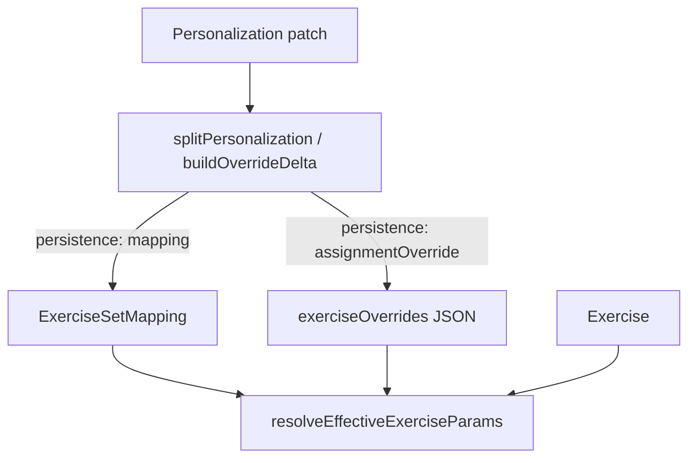

# SPEC-021 — Full Patient Personalization

## Cel biznesowy

Przy przypisywaniu planu pacjentowi terapeuta musi móc spersonalizować **wszystkie** parametry wykonania i treści ćwiczenia (nie tylko dawkowanie na mappingu). Sekcja „Odziedziczone z ćwiczenia” w kontekście pacjenta jest blokadą produktową — nie ograniczeniem technicznym.

## Architektura

### Routing persystencji (SSOT)

Każde pole w `fieldContract.ts` ma `persistence`:

| Persistence          | Warstwa zapisu                             | Przykłady                                                                               |
| -------------------- | ------------------------------------------ | --------------------------------------------------------------------------------------- |
| `mapping`            | `ExerciseSetMapping` (PATIENT_PLAN)        | sets, reps, tempo, load, notes, customName…                                             |
| `assignmentOverride` | `PatientAssignment.exerciseOverrides` JSON | side, rangeOfMotion, difficultyLevel, patientDescription, clinicalDescription, audioCue |
| `templateOnly`       | tylko `Exercise`                           | name, tags, media biblioteki                                                            |

Powierzchnia `patientPlan` = suma pól mapping + assignmentOverride. Używana w Assignment Wizard (`customize-set`) i dialogach pacjenta.

Powierzchnia `mapping` zostaje dla zestawów TEMPLATE — tam nie ma assignmentu, więc sekcja „Odziedziczone” jest poprawna.

### Write path w Assignment Wizard

1. `createExerciseSet(kind: PATIENT_PLAN)`
2. `addExerciseToExerciseSet` × N — **przechwyć** `mapping.id`
3. `assignExerciseSetToPatient` — **przechwyć** `assignment.id`
4. jeśli delta override niepusta: `updatePatientExerciseOverrides(assignmentId, JSON)`
5. błąd kroku 4 → `toast.warning`, assignment zostaje (dawkowanie już na mappingu)

Helpery: `buildAssignmentOverrideDeltasFromBuilder`, `remapOverrideDeltasToMappingIds`, `exercisePersonalizationWriter.ts`.

### Semantyka czyszczenia

JSON traktuje `undefined`/`null` jako „nie nadpisane”. Jawne wyczyszczenie: `''` (tekst), `'none'` (side), `'UNKNOWN'` (difficulty).

## Interfejsy

### GraphQL (bez zmian schematu)

- `UPDATE_PATIENT_EXERCISE_OVERRIDES_MUTATION` — istniejąca
- Nowe klucze JSON (additive): `difficultyLevel`, `patientDescription`, `clinicalDescription`, `audioCue`

### Cross-repo gate (fizjo-app)

Admin zapisuje i czyta nowe klucze od razu. Mobile ignoruje nieznane klucze do czasu implementacji odczytu:

- `difficultyLevel`
- `patientDescription`
- `clinicalDescription`
- `audioCue`

## Feature flags

- `ENABLE_EXTENDED_PATIENT_OVERRIDE_FIELDS` — tempo/load/prep/ROM
- `ENABLE_FULL_PATIENT_PERSONALIZATION` — difficulty + opisy + audioCue na patientPlan/override

## Risk Assessment

| Ryzyko                                           | Wpływ                                | Mitygacja                                              |
| ------------------------------------------------ | ------------------------------------ | ------------------------------------------------------ |
| Stale keys przy merge delta                      | override nie wraca do dziedziczonego | `replaceOverrideMapEntry` w dialogach (pełny snapshot) |
| Utrata mapping.id przy add                       | brak override                        | asercja + warning; dawkowanie i tak zapisane           |
| Mobile nie czyta nowych kluczy                   | admin OK, mobile pokazuje szablon    | lista gate w SPEC; additive JSON                       |
| Dual-write mapping+override dla tego samego pola | rozjazd                              | jedno pole → jedna warstwa w `persistence`             |

## Integration Test Coverage

- fieldContract: każde pole ma `persistence`; `patientPlan` zawiera side/ROM/difficulty
- writer: split + buildOverrideDelta + replaceOverrideMapEntry
- resolver: override precedence dla difficulty/tekstów
- mappingIntegrity: `surface=mapping` → inherited; `surface=patientPlan` → editable, brak sekcji
- assignmentPlanDecision: realna liczba customized

## Changelog

### 2026-07-28

- Wprowadzenie `FieldPersistence`, powierzchni `patientPlan`, writera personalizacji.
- Wizard zapisuje `exerciseOverrides` po assign.
- Karta `ExerciseExecutionCard` z `surface` — pełna edycja przy przypisaniu.
- Dialogi Edit/Add override na writerze + parity pól.
