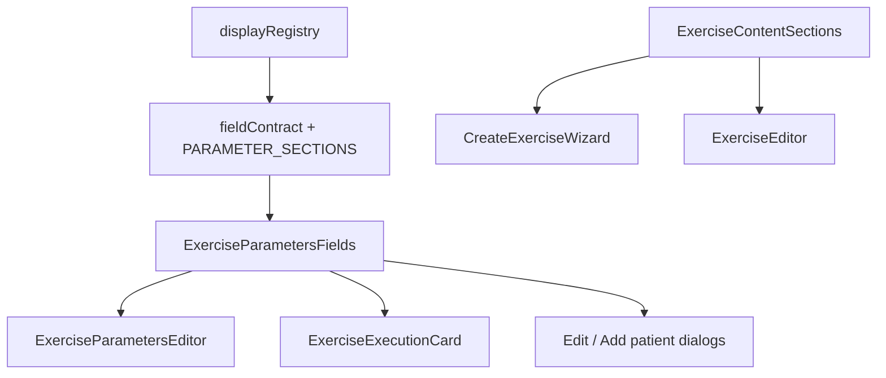

# SPEC-022 — Unified Exercise Parameters Presentation

## Cel biznesowy

Terapeuta nie może mieć wrażenia, że „parametry ćwiczenia” wyglądają i działają inaczej w kreatorze, edycji szablonu, edycji w zestawie i personalizacji pacjenta. Jedna prezentacja pól + parytet treści (enrichment) między create a edit.

## Architektura

### SSOT prezentacji

| Warstwa            | Plik                           | Rola                                                           |
| ------------------ | ------------------------------ | -------------------------------------------------------------- |
| Etykiety / format  | `displayRegistry.ts`           | labels, tooltips, formatValue                                  |
| Semantyka + sekcje | `fieldContract.ts`             | surfaces, tiers, `PARAMETER_SECTIONS`, `getParameterSections`  |
| Prezentacja        | `ExerciseParametersFields.tsx` | jedyny UI parametrów (badge timera, kafle wyliczane, advanced) |
| Adapter szablonu   | `ExerciseParametersEditor.tsx` | `ExerciseCoreDraft` → Fields                                   |
| Adapter karty      | `ExerciseExecutionCard.tsx`    | expanded panel → Fields (`omitFields: sets/reps`)              |
| Adapter override   | dialogi pacjenta               | Fields + `inheritedValues`                                     |

### Sekcje parametrów (kolejność kanoniczna)

1. **Podstawowe parametry** — sets, reps, executionTime, load, restSets + badge timera + kafle „Czas serii (wyliczany)” / „Czas ćwiczenia (wyliczany)”
2. **Zaawansowane** — Tempo/przerwy/ROM + Pozycja i klasyfikacja (lub inherited)
3. **Treść dla pacjenta** (opt-in) — patientDescription, notes, clinicalDescription, audioCue

`duration` żyje wyłącznie w sekcji zaawansowanej (legacy override czasu serii).

### Parytet treści create ↔ edit

- `ExerciseContentSections` — wspólny stack sekcji enrichment
- `useEnrichmentDraft` — draft enrichment w kreatorze
- `createExerciseSubmit` — `createExercise` → opcjonalnie `updateExercise(enrichmentDataJson)` z degradacją (`toast.warning`)

## Interfejsy

Bez zmian schematu GraphQL. Follow-up: dodać `enrichmentDataJson` do `CREATE_EXERCISE_MUTATION` (backend), aby uniknąć dual-call.

## Verification plan

- Unit: `fieldContract` kompletność sekcji; `parameterSurfaceParity`; `mappingIntegrity`; `createExerciseSubmit`; `exerciseContentSections.parity`
- E2E (fiziyo-tests): create / edit set params / patient override — wspólne etykiety i obecność advanced

## Changelog

### 2026-07-28

- Wprowadzenie `PARAMETER_SECTIONS` + `ExerciseParametersFields`
- Przepięcie karty, dialogów pacjenta i edytora szablonu
- Parytet treści w kreatorze przez `ExerciseContentSections` + dwustopniowy zapis enrichment
