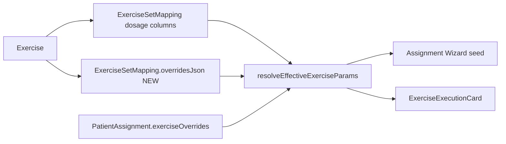

# SPEC-023 — Mapping overridesJson + deprecacja `duration`

## Cel biznesowy

1. **Zestawy szablonowe** muszą pozwalać personalizować stronę ciała, ROM, trudność i treści (nie tylko dawkowanie) — bez czekania do kroku przypisania pacjentowi.
2. **„Czas serii” (`duration`)** jako edytowalne pole jest zbędne i mylące obok wyliczanego czasu serii; edycja → `executionTime`, odczyt legacy zostaje.

## Architektura



Precedencja: **assignment override > mapping.overridesJson > mapping columns > template**.

### Zawsze włączone

`overridesJson` jest stałą częścią kontraktu admina: query/mutacje zawsze selekcjonują i wysyłają pole; powierzchnia `mapping` zawsze edytuje 6 pól klasyfikacji/treści. Brak feature flagi.

### Deprecacja `duration`

- `surfaces: []`, `DEPRECATED_FIELD_KEYS = ['duration']`
- Usunięte z `PARAMETER_SECTIONS` / edytora
- Warunkowy wiersz legacy gdy `duration > 0` + „Usuń nadpisanie” → `duration: 0`
- Inline tile ukryty (`isInlineVisible: false`)

## Interfejsy

### Backend (addytywny — wdrożone w fizjo-app/backend)

- Entity: `ExerciseSetMapping.OverridesJson` (`text`, nullable)
- Migracja: `AddOverridesJsonToExerciseSetMappings`
- Mutacje: `updateExerciseInSet` / `addExerciseToExerciseSet` przyjmują `overridesJson`
- Semantyka zapisu: `null` = bez zmian; `""` / `"{}"` = clear; inaczej walidowany obiekt JSON

```graphql
type ExerciseSetMapping {
  # existing fields…
  overridesJson: String
}

# updateExerciseInSet / addExerciseToExerciseSet:
#   overridesJson: String  (nullable JSON object, not keyed map)
```

Kształt JSON (subset `ExerciseOverrideFields`):

```json
{
  "exerciseSide": "left",
  "rangeOfMotion": "0–90°",
  "difficultyLevel": "HARD",
  "patientDescription": "…",
  "clinicalDescription": "…",
  "audioCue": "…"
}
```

Mobile **nie czyta** zestawów TEMPLATE — zero zmian w fizjo-app.

### Admin helpers

- `mappingOverrides.ts` — parse / build / merge
- `seedBuilderParamsFromMapping` — seed wizarda
- `buildMappingOverridesFromParams` — zapis z buildera zestawu

## Risk Assessment

| Ryzyko                                | Wpływ                | Mitygacja                                            |
| ------------------------------------- | -------------------- | ---------------------------------------------------- |
| Backend bez `overridesJson`           | query/mutacje padają | deploy backendu razem z adminem (addytywny kontrakt) |
| Stare `duration`                      | zły czas wyliczeń    | read-path honoruje; UI clear → 0                     |
| Dual-write assignment vs mapping JSON | rozjazd              | osobne warstwy; resolver ma jasną precedencję        |

## Integration Test Coverage

- `mappingOverrides.test.ts` — parse/build/merge
- `resolveEffectiveExerciseParams` — warstwa mapping.overridesJson
- `seedBuilderParamsFromMapping.test.ts` — seed wizarda
- `fieldContract` — duration deprecated; sections bez duration

## Verification plan

- Unit: powyżej
- Manual: po włączeniu flagi + backend — edycja side w zestawie TEMPLATE, potem assign → wartości w wizardzie
- `npm run lint && npm run test:run && npm run validate`

## Changelog

### 2026-07-28

- Deprecacja edycji `duration` + legacy clear row.
- Kontrakt `overridesJson` na mappingu (zawsze włączony), resolver + seed + zapis dialogów/buildera.
