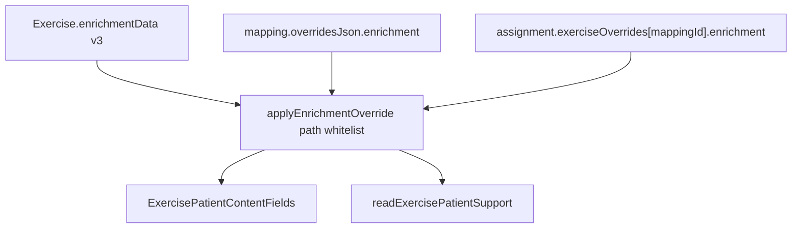

# SPEC-024 — Personalizacja enrichment (kroki / cues / safety)

## Cel biznesowy

Fizjoterapeuta przypisujący plan pacjentowi musi móc dostosować instrukcje widoczne w aplikacji pacjenta (kroki wykonania, wskazówki, błędy, odczucia, bezpieczeństwo) — bez edycji globalnego szablonu ćwiczenia. Edycja treści pacjenckiej ma wyglądać tak samo w edytorze ćwiczenia, zestawie i wizardzie assign.

## Architektura

Precedencja: **assignment override > mapping.overridesJson > template**.

### Whitelist ścieżek (11)

- `patient.summary`, `patient.steps`, `patient.cues`, `patient.mistakes`, `patient.should_feel`, `patient.should_not_feel`, `patient.why`, `patient.when_to_do`
- `safety.stop_if`, `safety.intensity_guide`, `safety.requires_supervision`

`therapist.*`, `ai.*`, `equipment` — tylko na szablonie. Listy nadpisywane całościowo.

### SSOT UI

| Warstwa                 | Plik                                                                         |
| ----------------------- | ---------------------------------------------------------------------------- |
| Kontrakt ścieżek/sekcji | `contentContract.ts`                                                         |
| Delta/merge             | `enrichmentOverride.ts` (admin) + `utils/enrichmentOverride.ts` (mobile)     |
| Prezentacja             | `ExercisePatientContentFields.tsx`                                           |
| Edytor szablonu         | `ExerciseContentSections` deleguje część pacjencką                           |
| Karta plan/zestaw       | `ExerciseExecutionCard` → collapsible „Instrukcje dla pacjenta” (lazy-mount) |

### Persystencja

Bez nowych pól GraphQL. Klucz `enrichment` w istniejącym JSON:

- `ExerciseSetMapping.overridesJson.enrichment` (TEMPLATE)
- `PatientAssignment.exerciseOverrides[mappingId].enrichment` (plan pacjenta)

Backend: limit 256 KB na payload overrides.

## Verification plan

- Unit admin: `enrichmentOverride`, `resolveEffectiveExerciseParams` (enrichment), `seedBuilderParamsFromMapping`, `contentContract`
- Unit mobile: `enrichmentOverride`, `applyExerciseOverrides` enrichment
- Manual: assign → zmień kroki → drugi pacjent/szablon bez zmian → apka pacjenta pokazuje spersonalizowane kroki
- Deploy: admin + mobile razem (backend addytywny)

## Changelog

### 2026-07-28

- Wprowadzenie whitelist path overrides dla patient/safety enrichment
- `ExercisePatientContentFields` + sekcja w `ExerciseExecutionCard`
- Mobile: `overridesJson` w fragmencie + merge enrichment w `applyExerciseOverrides`
- Backend: limit rozmiaru overrides JSON
