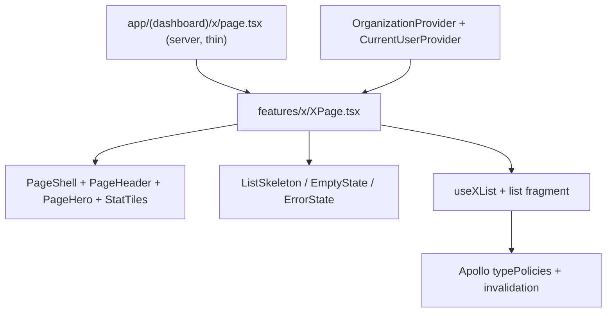

# SPEC-026 — Konsolidacja architektury, UI i warstwy danych

## Cel biznesowy

Panel terapeuty ma być spójny, szybki i przewidywalny: jeden szkielet stron,
jedna IA, jeden read-model organizacji/użytkownika i bezpieczna warstwa GraphQL.
Audyt z 2026-09-06 wykazał ~60 problemów (CI, tenant, martwy kod, god-componenty,
dryf copy). Konsolidacja obniża koszt utrzymania i ryzyko regresji cross-repo.

## Architektura

Decyzje:

- Additive-first dla kontraktów GraphQL (nowe fragmenty listowe obok pełnych).
- Dead UI usuwamy po grepie konsumentów; `ErrorBoundary` zostaje i jest montowany.
- `organizationId` i user id pochodzą z providerów, nie z powtórzonych query.
- RSC: layout dashboardu jako server shell + kliencki `DashboardShell`.
- Terminologia: „zestaw” = szablon, „plan” = przypisanie pacjenta. Zakaz „program” w UI.

## UI/UX Wireframes

Listy kliniczne (ćwiczenia, zestawy, pacjenci): kompaktowy `PageHeader` +
`PageHero` + `StatTiles` + search + treść. Settings/org: `PageShell variant="split"`.
Weryfikacja: ten sam header + operator 3-kolumnowy na detalu.

## Interfejsy

### GraphQL Queries/Mutations

- List fragments: `ExerciseListFragment`, `ExerciseSetListFragment` (bez enrichment).
- `patientAssignments` scoped organizationId jeśli schemat pozwala; w przeciwnym razie
  zastąpienie per-org query na dashboardzie.
- Cache helpers: `exerciseListRefetch`, `patientListRefetch`, `verificationQueueRefetch`.

### GraphQL Contracts

Nowe fragmenty additive. Pełne fragmenty zostają dla detali. Deprecacja starych
query listowych po migracji UI.

### Komponenty

| Komponent                                     | Lokalizacja                                  | Opis                          |
| --------------------------------------------- | -------------------------------------------- | ----------------------------- |
| PageShell / PageHeader / PageHero / StatTiles | `src/components/shared/page/`                | Szkielet stron                |
| ErrorState                                    | `src/components/shared/ErrorState.tsx`       | Błąd + retry                  |
| CurrentUserProvider                           | `src/contexts/CurrentUserContext.tsx`        | Jedno query usera             |
| VerificationQueue / Detail                    | `src/features/verification/`                 | Adaptery global/org/cross-org |
| navigation.config                             | `src/components/layout/navigation.config.ts` | IA desktop+mobile             |

## Data-testid

`page-header`, `page-hero`, `page-stat-tile-*`, `page-error-retry`,
`page-search-input`, `nav-link-*` (z configu). Istniejące ID list nie zmieniać.

## Risk Assessment

| Ryzyko                                       | Wplyw  | Mitigacja                                         |
| -------------------------------------------- | ------ | ------------------------------------------------- |
| Usunięcie „martwego” kodu z ukrytym importem | High   | Grep + tsc + test:run per grupa                   |
| Global cache-and-network zwiększa ruch       | Medium | nextFetchPolicy cache-first; zdjąć limit 3 slotów |
| DialogFooter justify-between psuje layout    | Medium | Przegląd top dialogów light/dark                  |
| Paginacja wymaga backendu                    | High   | Najpierw lekkie fragmenty; ticket backendowy      |
| AuthLink fail-closed blokuje publiczne query | Medium | Retry + refresh; test token exchange              |

## Integration Test Coverage

| Scenariusz                            | Typ testu         | Priorytet |
| ------------------------------------- | ----------------- | --------- |
| Happy path list + empty + error retry | Jednostkowy + E2E | High      |
| Token fail-closed + 401 refresh       | Jednostkowy       | High      |
| Org switch resetStore + dispose WS    | Jednostkowy       | High      |
| Zakazane słowa w UI                   | Jednostkowy       | Medium    |
| Assignment wizard po rozbiciu         | Regresja          | High      |

## Verification plan

- Unit: typePolicies, navigation.config, PageHeader/ErrorState, token exchange, forbidden copy.
- Gate fazy: `npm run lint`, `npm run type-check`, `npm run test:run`; końcowo `npm run validate`.
- E2E (`fiziyo-tests`): login → listy exercises/sets/patients → dialog create → assign.

## Changelog

### 2026-09-06

- Utworzenie specyfikacji na podstawie audytu i planu konsolidacji.
- Wdrożenie faz 0–6: fail-closed auth, usunięcie martwego kodu, Apollo cache, CurrentUserProvider, PageShell, wspólna IA, fragmenty listowe, RSC DashboardShell, testy i CI.
- Cienkie `page.tsx` + `*Page.tsx` w features; `useDialogShortcuts` w dialogach formularzowych; `check:testids` z parserem odpornym na `=>`; allowlista = 0.
- `getToken()` ponownie rzuca błędy z kodem HTTP (401 nie jest połykane jako `null`).
