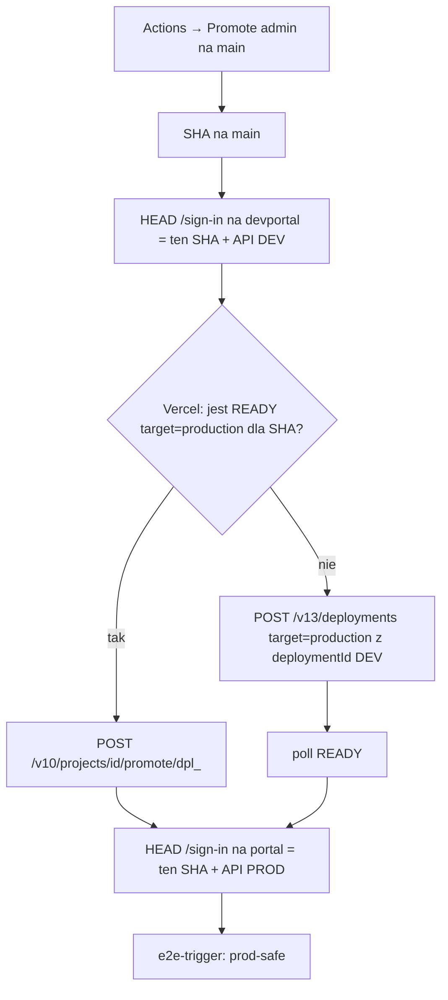

# Promote admin z repozytorium

## Cel biznesowy

Produkcja panelu (`portal.fiziyo.pl`) ma iść z GitHub Actions, tak jak API
(`Promote backend` w `fizjo-app`), a nie z kliknięcia Promote w Vercel.
Merge do `main` nadal wdraża tylko DEV (`devportal.fiziyo.pl`). Nic na PROD
bez człowieka i bez przebudowy na zmienne Production.

## Architektura

Vercel `POST /v10/.../promote/{id}` **nie przebudowuje**. Preview DEV ma
`NEXT_PUBLIC_*` z Clerk/API DEV utrwalone w buildzie — alias na
`portal.fiziyo.pl` jest zakazany. Preview zawsze idzie przez create
deployment z `target: production` (jak CLI `vercel promote` przy
`deployment.target !== production`).

Źródło prawdy środowisk: `docs/release-admin.md`. Kontrakt E2E bez zmian:
istniejący `e2e-trigger.yml` po `deployment_status=success` na Production.

## Poza zakresem

- Uruchomienie Promote w tej implementacji, zmiana sekretów Vercel, auto-deploy
  Production z git, rollback workflow, manifest E2E v2 jako twardy gate
  (zostaje w `fizjo-app` Certify/Promote backend).
- GraphQL, UI, auth, tenant.

## Interfejsy

- Workflow: `.github/workflows/promote.yml` — tylko `workflow_dispatch`.
- Wejścia: `sha` (puste = czubek main), opcjonalny `deployment_id` produkcji
  tego SHA, `override_reason` (≥8 znaków) pomija wyłącznie live DEV identity.
- Sekrety (nie w repo): `VERCEL_TOKEN`, `VERCEL_PROJECT_ID`, opcjonalnie
  `VERCEL_TEAM_ID`.
- Skrypt: `scripts/promote-admin.mjs`.

### GraphQL Queries/Mutations

Brak.

### Komponenty

Brak UI.

## Data-testid

Brak nowych elementów interaktywnych.

## Risk Assessment

| Ryzyko | Wpływ | Mitygacja |
| ------ | ----- | --------- |
| Alias Preview DEV na prod domenę | High — prod Clerk/API zastąpione DEV | Planner nigdy nie woła `/promote` gdy `target !== production` |
| `vercel deploy --prod` bez git metadata | High — brak nagłówków SPEC-026 | Create przez API z `deploymentId` albo `gitSource`; live HEAD wymaga SHA |
| Token w logach | High | Fetch nie loguje body ani Authorization; evidence JSON bez sekretów |
| GitHub Free: `environment: production` bez protection | Medium | Jak w `fizjo-app`: procedura Adama, nie wymuszone review |
| Agent odpala workflow | High | `agent-guard` już blokuje `gh workflow run promote.yml` |

## Integration Test Coverage

| Scenariusz | Typ testu | Priorytet |
| ---------- | --------- | --------- |
| Preview → rebuild, production → alias | Jednostkowy | High |
| Odrzucenie aliasu Preview i złego SHA | Jednostkowy | High |
| Live identity mismatch / brak tokenu | Jednostkowy | High |
| Workflow tylko dispatch, inputy przez env | Kontrakt YAML | High |

## Verification plan

- `node --test scripts/promote-admin.test.mjs`
- `npm run agent:test` (nowy plik w globie)
- Live Promote i sekrety Vercel: unverified do pierwszego ręcznego runu Adama.

## Changelog

### 2026-09-15

- Utworzenie specyfikacji i implementacja workflow + skryptu bramek.
