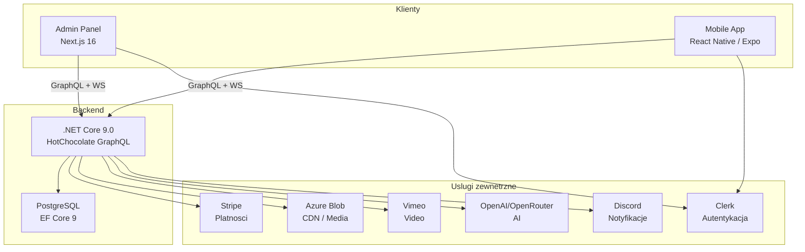
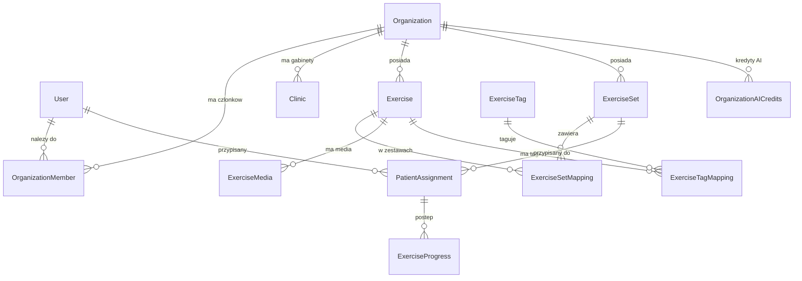

# Kompleksowy opis projektu FiziYo dla zewnętrznego doradcy

Dokument opisuje cały ekosystem FiziYo: kontekst biznesowy, architekturę techniczną, model monetyzacji, pracę z AI oraz status projektu. Przeznaczony jest dla zewnętrznego doradcy, który nie zna projektu i potrzebuje pełnego kontekstu do rekomendacji.

---

## 1. Executive Summary

**FiziYo** to platforma dla fizjoterapeutów i gabinetów fizjoterapii, łącząca:

- **Panel administracyjny (web)** -- zarządzanie ćwiczeniami, zestawami, pacjentami, rozliczeniami i organizacją
- **Aplikację mobilną (iOS/Android)** -- dla terapeutów i pacjentów: wykonywanie ćwiczeń, śledzenie postępów, wizyty, chat
- **Wspólny backend (.NET)** -- API GraphQL, płatności, media, AI

**Problem, który rozwiązujemy:** Fizjoterapeuci nie mają dobrego, zintegrowanego narzędzia do: tworzenia i przypisywania zestawów ćwiczeń, komunikacji z pacjentem, śledzenia postępów oraz rozliczeń. Rozwiązania są rozproszone (Excel, notatniki, oddzielne aplikacje) lub nieadekwatne.

**Etap rozwoju:** Projekt w fazie beta. Panel admin i aplikacja mobilna są w produkcji (Vercel, App Store, Google Play). Backend hostowany na Azure. Fizjoterapeuci na start nie płacą -- jedyny przychód to prowizja od płatności pacjentów (Revenue Share).

**Kluczowe liczby (orientacyjne):**

- **2 repozytoria:** fiziyo-admin (panel), fizjo-app (mobile + backend w jednym repo)
- **38+ encji** w bazie, **59+ migracji** EF Core
- **24 zapytania GraphQL**, **15 mutacji**, subskrypcje real-time
- **5 aktywnych specyfikacji** modułów (`.ai/specs/`)
- **Dwa główne widoki w aplikacji mobilnej:** Pacjent i Terapeuta, każdy z wieloma ekranami

---

## 2. Kontekst biznesowy

### Problem rynkowy

- Fizjoterapeuci zarządzają ćwiczeniami i pacjentami w sposób niesystematyczny (arkusze, notatniki, różne aplikacje).
- Brak jednego miejsca: biblioteka ćwiczeń + przypisania + postępy pacjenta + komunikacja.
- Pacjent często nie ma stałego dostępu do swojego programu ćwiczeń ani feedbacku po wizycie.

### Grupa docelowa

- **Organizacje:** gabinety fizjoterapii, praktyki jednoosobowe, sieci klinik
- **Terapeuci:** właściciele, zatrudnieni fizjoterapeuci, administratorzy
- **Pacjenci:** osoby z przypisanym zestawem ćwiczeń, korzystające z aplikacji mobilnej

### Value proposition

- **Jedna platforma:** ćwiczenia, zestawy, pacjenci, przypisania, postępy, wizyty, chat -- w panelu web i w aplikacji.
- **Dla terapeuty:** szybsze tworzenie i przypisywanie zestawów, śledzenie realizacji, wsparcie AI (sugestie, generowanie, notatki).
- **Dla pacjenta:** jasny program ćwiczeń w telefonie, odtwarzacz z timerem/seriami, historia, kontakt z terapeutą.

### Role użytkowników

| Rola          | Kontekst                    | Główne uprawnienia                                                     |
| ------------- | --------------------------- | ---------------------------------------------------------------------- |
| **Owner**     | Właściciel organizacji      | Pełna konfiguracja, billing, zaproszenia                               |
| **Admin**     | Administrator w organizacji | Zarządzanie członkami, ustawienia organizacji                          |
| **Therapist** | Fizjoterapeuta              | Ćwiczenia, zestawy, pacjenci, przypisania, notatki, wizyty             |
| **Patient**   | Pacjent                     | Własne zestawy, odtwarzacz ćwiczeń, historia, wizyty, chat z terapeutą |

Multi-tenancy: użytkownik może należeć do wielu organizacji; kontekst organizacji wybierany w UI i przekazywany w tokenie (JWT).

---

## 3. Model monetyzacji

### Kluczowa zasada: fizjo płaci tylko wtedy gdy zarabia

Na starcie firmy nie pobieramy od fizjoterapeutów żadnych stałych opłat. Jedyny aktywny model to **Revenue Share** -- prowizja od płatności pacjentów.

### Revenue Share -- aktywny model

1. **Fizjo sprzedaje usługę premium** pacjentowi za pośrednictwem naszej aplikacji (orientacyjnie ~39 PLN/mies., kwota nie jest jeszcze ustalona; możliwe plany kilkumiesięczne z inną kwotą).
2. **Pacjent płaci** za dostęp premium do aplikacji.
3. **Platforma (FiziYo) pobiera prowizję** z tej płatności (orientacyjnie ~60%, procenty w trakcie ustalania).
4. **Fizjo otrzymuje resztę** na swoje konto (Stripe Connect).

Na start: fizjo oznacza w panelu ilu pacjentów jest "premium" (np. zaznacza 10 klientów). Uznajemy, że za nich dostał pieniądze i możemy go obciążyć prowizją. Fizjo musi podać dane firmy do wystawiania faktur.

**Na start: żadnych subskrypcji, żadnych planów, żadnych opłat stałych.** Fizjo zaczyna za 0 PLN i płaci dopiero gdy zarabia.

### Subskrypcje organizacji -- przygotowane, nieaktywne

W backendzie istnieje pełna struktura planów (Starter/Solo/Pro/Business z limitami pacjentów, terapeutów, gabinetów, kredytów AI), ale **nie jest aktywna**. Może być uruchomiona w przyszłości jako dodatkowe źródło przychodu. Kod jest zachowany.

### AI Credits

- System kredytów AI istnieje w backendzie (miesięczne + dokupywane paczki).
- 1 kredyt = 1 wiadomość w chacie AI.
- Logowanie zużycia: `AICreditsLog`, zarządzanie: `OrganizationAICredits`.

### Integracja płatności

- **Stripe:** Checkout Sessions, Connect (payouts dla fizjo), Webhooks (`/stripe/webhook`).
- Backend: `StripeController`, `StripeClientService`, `BillingService`, `RevenueShareService`, `CommissionService`.
- System płatności będzie aktualizowany -- na start maksymalnie prosty (oznaczanie klientów + faktura).

---

## 4. Architektura systemu

- **Klienty:** Panel (Vercel) i aplikacja mobilna (Expo/React Native) łączą się z tym samym backendem przez **GraphQL** (HTTP + WebSocket dla subskrypcji).
- **Autentykacja:** Clerk w UI -> wymiana tokena (Token Exchange) -> **własny JWT** używany w API.
- **Backend:** .NET 9, HotChocolate GraphQL, PostgreSQL, EF Core.
- **Zewnętrzne:** Stripe (płatności), Azure Blob + CDN (obrazy/pliki), Vimeo (wideo), OpenAI/OpenRouter (AI), Discord (np. powiadomienia wewnętrzne, feedback).

---

## 5. Komponenty systemu (trzy "części" -- dwa repozytoria)

### 5.1 Panel administracyjny (`fiziyo-admin`)

**Lokalizacja:** osobne repozytorium (`fiziyo-admin`).

**Stack:** Next.js 16, React 19, TypeScript 5 (strict), Apollo Client 4, Tailwind CSS 4, shadcn/ui, react-hook-form + zod, TanStack React Table.

**Hosting:** Vercel.

**Główne moduły i strony:**

- **Ćwiczenia** -- CRUD, tagi, filtry, wyszukiwanie, weryfikacja (kolejka do publikacji globalnej), parametry (reps/time), media (obraz, wideo, GIF).
- **Zestawy ćwiczeń** -- tworzenie, edycja, mapowania ćwiczeń (ExerciseSetMapping), szablony vs draft.
- **Pacjenci** -- lista, profil pacjenta, przypisania zestawów, proste notatki, status terapii.
- **Assignment Wizard** -- 5 kroków: zestaw -> pacjenci -> personalizacja -> harmonogram -> podsumowanie (szczegóły w `docs/assignment-wizard-overview.md`).
- **Billing / Finanse** -- oznaczanie klientów premium, prowizja, dane firmy do faktur.
- **Organizacja** -- ustawienia organizacji, członkowie. Zarządzanie klinikami (oddziałami) -- nie w pełni zaimplementowane.
- **Wizyty (Appointments)** -- harmonogram wizyt.
- **Import** -- import dokumentów (PDF/Excel/CSV) z wykorzystaniem AI.
- **Weryfikacja** -- kolejka ćwiczeń do weryfikacji globalnej (np. tagi, opisy).
- **Ustawienia** -- profil użytkownika, kredyty AI, organizacje.
- **Onboarding** -- flow pierwszego logowania.

**Jakość i CI/CD:** ESLint, type-check, Vitest (testy jednostkowe), `npm run validate` (lint + type-check + build). GitHub Actions: lint, type-check, test, build na PR do `dev`/`main`.

**Dokumentacja wewnętrzna:** `AGENTS.md` (główne wytyczne), modułowe AGENTS.md (exercises, assignment, patients, graphql, shared, exercise-sets, settings), `.ai/specs/` (SPEC-001...005), `.ai/ECOSYSTEM.md`, `.ai/DOMAIN_MODEL.md`, `.ai/DATA_FLOWS.md`.

---

### 5.2 Aplikacja mobilna (`fizjo-app`)

**Lokalizacja:** repozytorium `fizjo-app` (w tym samym repo co backend w folderze `backend/`).

**Stack:** React Native, Expo (Expo Router), NativeWind (Tailwind dla RN), Apollo Client 4, TypeScript.

**Platformy:** iOS (App Store), Android (Google Play). Build: EAS Build (profile: development, preview, production).

**Widok Pacjenta (tabs):**

- Dashboard -- przegląd zestawów, aktywność.
- Zestawy -- lista przypisanych zestawów.
- Odtwarzacz ćwiczeń -- fullscreen, reps/time, timer, seria/odpoczynek (`RepsExercisePlayer`, `TimeExercisePlayer`).
- Podsumowanie po ćwiczeniu -- np. ból, trudność, notatki.
- Historia -- ukończone ćwiczenia.
- Wizyty -- terminy, rezerwacja.
- Chat -- komunikacja z terapeutą (oraz AI).
- Profil -- dane, terapia.

**Widok Terapeuty (tabs):**

- Dashboard -- przegląd.
- Pacjenci -- lista, przypisania, raporty.
- Ćwiczenia -- biblioteka.
- Zestawy -- tworzenie/edycja zestawów.
- Kalendarz -- wizyty.
- Video Inbox -- przegląd wideo od pacjentów.
- Recorder -- nagrywanie wideo ćwiczeń.
- Organizacja -- zespół.
- Chat -- pacjenci + AI.
- More -- ustawienia, zasoby.

**Autentykacja:** Clerk (`@clerk/clerk-expo`) -> Token Exchange -> backend JWT w Expo SecureStore. Role: patient, physio, company (kontekst `UserRoleContext`). Deep linking: `fizjo://` (prod), `fizjo-dev://` (dev), m.in. `/connect` (QR łączenie pacjent-terapeuta).

**Media:** obrazy -- upload przez GraphQL, Azure Blob, CDN; wideo -- nagrywanie (expo-camera), odtwarzanie (expo-video), Vimeo (backend). Dźwięk/haptics: sygnały podczas ćwiczeń, haptic feedback.

**Testy:** Jest + React Native Testing Library. `npm run test:ci`, `npm run test:coverage`.

---

### 5.3 Backend (.NET Core 9.0)

**Lokalizacja:** `fizjo-app/backend/` (solution: `backend.sln`).

**Projekty:** FizjoApp.Api (główny API), FizjoApp.Api.Tests, FizjoApp.Stripe.Client.Api, FizjoApp.ChatTester.

**API:**

- **GraphQL (HotChocolate):** ok. 24 typy zapytań (Exercise, Patient, Organization, Billing, Revenue, Appointments, Tags, Video Inbox, AI Credits itd.), ok. 15 typów mutacji (CRUD ćwiczeń, zestawów, pacjentów, przypisań, organizacji, billing, zaproszeń itd.).
- **Subskrypcje:** real-time przez PostgreSQL LISTEN/NOTIFY (np. exercise/set/patient/assignment/tag created/updated/deleted).
- **REST:** `/api/chat/simple` (chat AI), `/api/ai/*` (sugestie, generowanie, weryfikacja, analiza dokumentów, voice, obraz), `/api/webhooks/clerk`, `/stripe/webhook`, uploady mediów, feedback, GitHub sync ćwiczeń, migracje DB.

**Baza danych:** PostgreSQL, EF Core 9, Npgsql. 38+ encji, 59+ migracji. JSONB dla: ExerciseLoad, Frequency, Translations, AssignedLoad itd.

**Kluczowe serwisy:** UserService, PermissionService, SubscriptionFeaturesService, BillingService, RevenueShareService, CommissionService, AICreditsService, DocumentAnalysisService, PatientNotificationService, WeeklyProgressService, HealthPointsService, BlobStorageService, VimeoVideoService, DiscordNotificationService, SetExpirationBackgroundService itd.

**Hosting:** Azure App Service, Docker (multi-stage), port 8080. Baza: PostgreSQL (np. Neon compatible).

---

## 6. Kluczowe encje domenowe

- **User** -- użytkownik (ClerkId, email, dane osobowe/kontaktowe). Może być shadow user (bez hasła, utworzony przez terapeutę).
- **Organization, OrganizationMember** -- multi-tenancy, role.
- **Clinic, TherapistClinic** -- gabinety/oddziały organizacji. **Nie w pełni zaimplementowane** -- struktura istnieje w backendzie, ale zarządzanie klinikami (wiele placówek jednej firmy) wymaga dopracowania w UI.
- **Exercise** -- typ (REPS/TIME), strona (NONE/LEFT/RIGHT/BOTH/ALTERNATING), zakres (PERSONAL/ORGANIZATION/GLOBAL), status (DRAFT -> PENDING_REVIEW -> APPROVED -> PUBLISHED), obciążenie (JSONB -- docelowo ograniczone do kg), tagi, relacje (progression/regression).
- **ExerciseSet, ExerciseSetMapping** -- zestaw i pozycje z opcjonalnymi nadpisaniami parametrów.
- **PatientAssignment, AssignmentCustomization** -- przypisanie zestawu do pacjenta, personalizacja, harmonogram (Frequency JSON).
- **ExerciseProgress** -- ukończone serie/czas, ból, trudność, notatki pacjenta.
- **Notatki pacjenta** -- w backendzie istnieje encja ClinicalNote ze złożoną strukturą kliniczną (wywiad, badanie, diagnoza, plan leczenia), ale **docelowo zostanie uproszczona** do prostych, user-friendly notatek per pacjent.
- **Billing:** PatientSubscription, RevenueTransaction, BillingCycle -- Revenue Share (prowizja od płatności pacjentów).
- **AI:** OrganizationAICredits, AICreditsLog.
- **Inne:** OrganizationInvitation, VideoAsset (Vimeo), HealthPoints, PatientNotification itd.

---

## 7. Funkcje AI

- **Chat AI** -- endpoint `/api/chat/simple`, sesje (HybridCache 30 min), function calling (FindExercises, FindExerciseSets, GetCurrentUser, GetExerciseTags). Koszt: 1 kredyt/wiadomość.
- **Sugestie ćwiczeń** -- parametry na podstawie nazwy (`/api/ai/exercise-suggest`).
- **Generowanie zestawów** -- zestaw z opisu (`/api/ai/set-generate`).
- **Voice parsing** -- głos -> struktura ćwiczeń (`/api/ai/voice-parse`).
- **Generowanie obrazów** -- ilustracja/diagram/zdjęcie do ćwiczenia (Gemini 2.5 Flash, `/api/ai/generate-image`).
- **Weryfikacja ćwiczeń** -- sugestie tagów, przeformulowanie opisu, walidacja (`/api/ai/verification/*`), cache 7 dni.
- **Analiza dokumentów** -- PDF/Excel/CSV/TXT -> ćwiczenia/zestawy (`/api/ai/document-analyze`).

Backend: Microsoft.Extensions.AI (OpenAI/OpenRouter, opcjonalnie Ollama). Kredyty: miesięczne + addony, AICreditsService.

---

## 8. Autentykacja i bezpieczeństwo

- **Flow:** Logowanie/rejestracja w **Clerk** (panel + aplikacja) -> **Token Exchange** (Clerk JWT -> własny JWT backendu) -> wszystkie requesty GraphQL/REST z backend JWT.
- **Przechowywanie tokena:** Panel -- sessionStorage; aplikacja -- Expo SecureStore. TTL tokena: 10 h, odświeżanie przy wygaśnięciu, walidacja tożsamości (ClerkId).
- **Multi-tenant:** W JWT: `organization_id`, `role`. Przełączanie organizacji w UI powoduje odświeżenie tokena.
- **Clerk webhook:** `user.created`, `user.updated` -- tworzenie/aktualizacja User, auto-tworzenie organizacji dla company, konwersja shadow -> pełny użytkownik.
- **Shadow user:** Terapeuta tworzy pacjenta bez hasła (np. telefon wymagany); pacjent później aktywuje konto linkiem (activation token).

---

## 9. Praca z AI (agenty, workflow, spec-first)

- **AGENTS.md (Task Router):** W głównym `AGENTS.md` jest tabela zadań -> guide (exercises, assignment, patients, graphql, shared, exercise-sets, settings, ecosystem, domain model, data flows). Agenty przed pracą dopasowują zadanie i czytają pasujące guide'y.
- **Wiedza domenowa (.ai/):** `ECOSYSTEM.md` (mapa cross-repo), `DOMAIN_MODEL.md` (encje/enumy/relacje), `DATA_FLOWS.md` (flow biznesowe z diagramami).
- **Spec-first:** Nowe, nietrywialne funkcje -- najpierw specyfikacja w `.ai/specs/`, potem kod.
- **Lessons learned:** `.ai/lessons.md` -- dziennik wniosków z pracy AI.
- **Umiejętności (skills):** Dedykowane pliki dla code review, spec writing, tworzenia AGENTS.md.
- **Testy i jakość:** Obowiązkowe `data-testid` na interaktywnych elementach. `npm run validate` (lint + type-check + build) przed zakończeniem.

---

## 10. Status projektu -- co działa, co wymaga pracy

### Zrobione i działające

- Pełny CRUD ćwiczeń z tagami, mediami, parametrami (reps/time), weryfikacją globalną
- Zestawy ćwiczeń z mapowaniami i szablonami
- Assignment Wizard (5-krokowy)
- Odtwarzacz ćwiczeń w aplikacji mobilnej (reps + time)
- Rejestracja i autentykacja (Clerk + Token Exchange)
- Shadow users (fizjo tworzy konto pacjenta)
- Profil pacjenta z przypisaniami i postępami
- Chat AI z function calling
- Deep linking (QR code pacjent-terapeuta)
- Real-time subscriptions (panel admin)
- CI/CD (GitHub Actions + EAS Build)
- Infrastruktura AI (sugestie, generowanie, weryfikacja, voice, obrazy, dokumenty)

### Wymaga pracy / nie w pełni zaimplementowane

- **Notatki pacjenta** -- obecna encja ClinicalNote jest zbyt kliniczna (sekcje: wywiad, badanie, diagnoza). Docelowo: proste, user-friendly notatki per pacjent.
- **Obciążenie (ExerciseLoad)** -- obecna struktura pozwala wpisać dowolny typ, co prowadzi do bałaganu. Docelowo: ograniczenie do kg.
- **Zarządzanie klinikami** -- struktura istnieje, ale UI do zarządzania wieloma placówkami jednej firmy nie jest dopracowane.
- **System płatności** -- na start maksymalnie prosty (fizjo oznacza klientów premium + dane firmy do faktury). Stripe Connect gotowy, ale flow do dopracowania.
- **Push notifications** -- backend gotowy (`PatientNotificationService`), w mobile brak integracji (Expo Notifications, APNs/FCM).
- **Offline** -- Apollo cache-first, ale brak jawnej kolejki mutacji offline.
- **E-mail** -- brak systemu e-maili; Discord jako workaround na powiadomienia wewnętrzne.
- **Subskrypcje organizacji** -- kod przygotowany, nieaktywny (do uruchomienia w przyszłości).

---

## 11. Infrastruktura i DevOps

| Element                  | Technologia / usługa                                               |
| ------------------------ | ------------------------------------------------------------------ |
| Panel admin              | Vercel                                                             |
| Backend API              | Azure App Service, Docker (multi-stage, .NET 9)                    |
| Baza danych              | PostgreSQL (Neon compatible), EF Core migrations                   |
| Media (obrazy/pliki)     | Azure Blob Storage, CDN                                            |
| Wideo                    | Vimeo (TUS upload, embed)                                          |
| Autentykacja             | Clerk (dashboard + webhook Svix)                                   |
| Płatności                | Stripe (Checkout, Connect, Webhooks)                               |
| AI                       | OpenAI / OpenRouter (Microsoft.Extensions.AI)                      |
| Powiadomienia wewnętrzne | Discord (webhooks)                                                 |
| CI/CD panel              | GitHub Actions (lint, type-check, test, build)                     |
| CI/CD mobile             | GitHub Actions + EAS Build / EAS Submit                            |
| Aplikacja mobilna        | EAS Build (dev/preview/production), App Store Connect, Google Play |

---

## 12. Podsumowanie dla doradcy

- **Co mamy:** Działającą platformę z panelem web (Next.js), aplikacją mobilną (Expo) i backendem .NET z GraphQL. Płatności (Stripe Connect), media (Azure, Vimeo), rozbudowane funkcje AI, real-time. Multi-tenant, role, shadow users.
- **Model biznesowy:** Revenue Share -- fizjo płaci tylko gdy zarabia (prowizja od płatności pacjentów). Brak stałych opłat na start. Struktura subskrypcji przygotowana na przyszłość.
- **Jak pracujemy:** Spec-first z AI agentami, AGENTS.md i guide'y modułowe, lessons learned, testy i data-testid, walidacja przed merge.
- **Kluczowe obszary do rekomendacji:**
  - Uproszczenie notatek pacjenta (z klinicznych na user-friendly)
  - Uproszczenie obciążenia ćwiczeń (ograniczenie do kg)
  - Dopracowanie flow płatności (oznaczanie premium + fakturowanie)
  - Push notifications (backend gotowy, mobile nie)
  - Zarządzanie klinikami (wieloma placówkami)
  - Offline mode w mobile
  - System e-maili
  - Przejście z Revenue Share na ewentualne dodatkowe modele (subskrypcje)
  - Bezpieczeństwo i compliance (dane medyczne, RODO)

Dokument można uzupełniać o konkretne metryki (MAU, liczba organizacji, konwersje) oraz roadmapę biznesową po udostępnieniu tych danych przez zespół.
